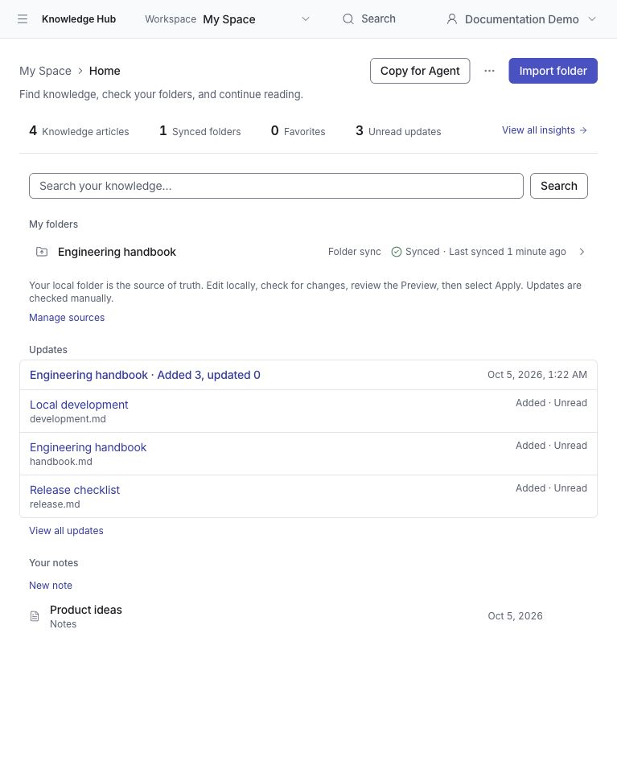
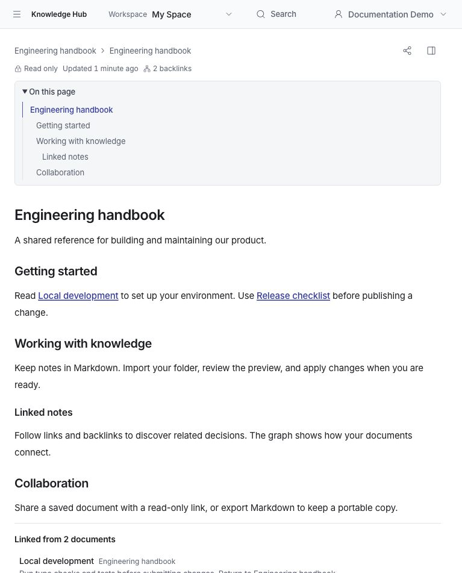
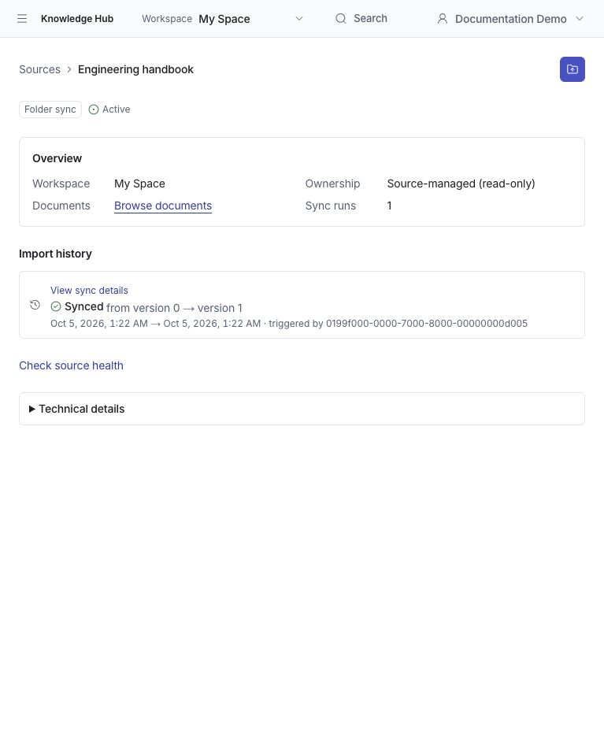
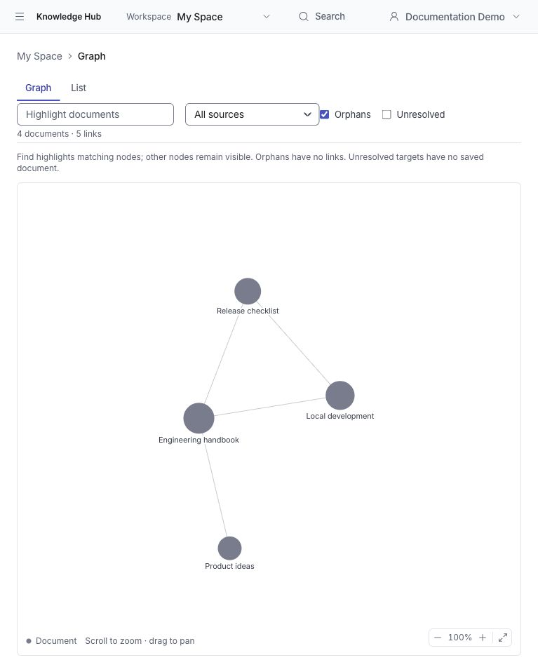

# Knowledge Hub

**English** | [繁體中文](README.zh-TW.md)

[](LICENSE)
[](package.json)

**Turn Markdown notes into a knowledge workspace you can read, connect, and share.**

Knowledge Hub is an open-source, self-hosted knowledge management application. Write notes in your browser or import an existing Markdown folder or LLM Wiki. Find content through search, follow links and backlinks, explore a knowledge graph, and share saved documents with others. Content stays in Markdown without requiring a particular note-taking app, wiki generator, or external knowledge platform.

The current version is **0.1.0 and under active development**. A personal workspace, **My Space**, is available by default. Team workspace navigation and access are disabled by default and can be enabled by an administrator. Development uses a local demo identity; production deployments require integration with a trusted identity provider. See [Deployment](#deployment).

[Quick start](#quick-start) · [Features](#features) · [Configuration](#configuration) · [Development and testing](#development-and-testing) · [Contributing](CONTRIBUTING.md) · [License](#license)

## Screenshots

Captured on **October 5, 2026 (Asia/Taipei)** from a fresh production build of remote main [`3739efb1`](https://github.com/mike840609/knowledge-hub/commit/3739efb12906e1cb2e6abc1b5eea7727914a08ab), using a dedicated demo account and synthetic English notes. The responsive layout shown uses the browser's 767 × 951 viewport. See the [capture provenance](docs/images/README.md) for version and verification details.

### Personal home

Review your synced folders, unread updates, personal notes, and knowledge statistics from My Space.



### Document reader

Read Markdown with a table of contents, resolved wikilinks, and backlinks to related documents.



### Sources and sync history

Review a Markdown folder's ownership and sync history, then use **Update from folder** to select the source folder again and review changes.



### Knowledge graph

Explore links between documents, find a note, and filter the graph by source.



## Features

| Feature | What it provides |
| --- | --- |
| Personal workspace | My Space, personal notes, drafts, favorites, and recently read documents; reading history stays on the device |
| Markdown editing | Rendered editing and Markdown source modes, code blocks, a table of contents, and keyboard shortcuts |
| Drafts and revisions | Account-backed autosave, local recovery on failure, immutable revision history, comparison and restore, and stale-editor conflict checks |
| Import and sync | Import a Markdown folder through Preview → Confirm → Apply; select the folder again to review and apply later changes |
| Organization | Document and folder trees, move, rename, archive, and restore; source-managed content is updated through sync |
| Search | Workspace-scoped keyword search and quick search with `⌘K` / `Ctrl+K` |
| Knowledge links | `[[wikilinks]]`, relative `.md` links, backlinks, and workspace and local graphs |
| Sharing | Revocable, anonymous read-only links for individual My Space documents; shares expose saved content, not drafts |
| Export | Individual Markdown downloads and a My Space ZIP with directory structure and a stable ID/path manifest |
| Agent context | Copy for Agent and workspace-scoped read/context APIs that follow the application's access rules |
| Team workspaces (opt-in) | Workspace administration, membership, roles and capabilities, external group mapping, and audit records |

### Content ownership

- **Folder Sync (`SOURCE_MANAGED`)**: the original folder is the source of truth. Edit the original Markdown files, generate a new preview, and apply it. Hub does not directly edit synced content or monitor your local folder in the background.
- **Web Create / individual Upload (`HUB_MANAGED`)**: Hub manages the content after creation or upload. Edit it in the browser; saving creates a new revision.

A preview is a fixed staged snapshot. Resolve blocking diagnostics before applying it. If the source version changes, Apply returns a conflict and you must generate a new preview.

### Current limitations and future direction

- Assets store metadata and references only; there is no binary attachment storage service yet.
- ZIP exports include the latest saved versions of archived documents, but exclude drafts, revision history, and attachment bytes. The limit is 64 MiB / 9,999 documents.
- Documents use archive and restore for their lifecycle; there is no general end-user permanent deletion flow.
- Search is currently keyword-based. An MCP server, semantic/hybrid retrieval, and advanced agent memory are future directions, not shipped features.
- Team workspaces display **Coming soon** by default. Enabling the feature flag does not complete production identity integration.

## Quick start

### Prerequisites

- Node.js **20.19.0 or later, below 25**. [`.node-version`](.node-version) specifies 24.19.0.
- npm, using the repository's `package-lock.json`.
- Docker and Docker Compose v2 with support for `up --wait`, to run MariaDB 10.11.
- `make` and Git. If `make` is unavailable, use the npm steps below.

```bash
git clone https://github.com/mike840609/knowledge-hub.git
cd knowledge-hub
make bootstrap
make dev
```

Open **http://127.0.0.1:3000/** to enter My Space.

`make bootstrap` installs dependencies, copies `.env.example` if `.env` does not exist, starts the database, runs migrations, and loads development fixtures. An existing `.env` is preserved. The example database credentials are for local development only.

### Without make

```bash
npm ci
cp .env.example .env  # First setup only; preserve and review an existing .env
docker compose up -d --wait mariadb
npm run db:migrate
npm run db:seed
npm run dev
```

### Your first workflow

1. Choose **New note** to write a note, or **Import folder** to bring in a Markdown folder. The import page links to an in-app guide, "Bring your wiki into Knowledge Hub", and offers **Try with a sample wiki**: it imports a ready-made folder (English or Traditional Chinese, from `public/sample-wiki/`) through the normal Preview → Apply flow.
2. For imports, review additions, updates, archives, and diagnostics in Preview before applying changes.
3. Use `[[Document title]]` in editable notes to link documents, then open Graph to explore relationships.
4. Save a note before creating a read-only share link or downloading its Markdown.
5. When your local source changes, select the folder again and follow Preview → Apply.

## Configuration

See [`.env.example`](.env.example) for local development settings and import limits. Restart the application after changing server environment settings.

| Setting | Purpose / default |
| --- | --- |
| `KM_DB_HOST` / `KM_DB_PORT` | MariaDB address; locally `127.0.0.1:3307` |
| `KM_DB_USER` / `KM_DB_PASSWORD` / `KM_DB_NAME` | Application database credentials and database name |
| `KM_LOCAL_IDENTITY_ENABLED` | Local development identity; `true` in the example |
| `KM_LOCAL_ID` / `KM_LOCAL_EMP_ID` / `KM_LOCAL_NAME` / `KM_LOCAL_ORG_CODE` | Server-configured local identity, rather than a login form |
| `KM_TEAM_WORKSPACES_ENABLED` | Defaults to `false`; set to `true` to enable Team navigation and access |
| `KM_IDENTITY_PROVIDER` | Defaults to `local`; production uses `company-sso` with a session reader integration |
| `KM_IMPORT_*` | Import file counts, sizes, batch limits, and snapshot quotas |
| `KM_TEST_DB_*` / `KM_E2E_DB_PREFIX` | Isolated test database settings; the test account must be able to create and drop databases with the designated prefixes |

Default import limits include 20,000 manifest entries, 5 MiB per Markdown file, and 256 MiB of Markdown in total. See `.env.example` for the full limits. Snapshot retention is 2 hours for BUILDING, 30 minutes for READY, and 24 hours for STALE/APPLIED. Periodically clean up expired staging data with:

```bash
npx tsx scripts/db/cleanup-import-snapshots.ts
```

This cleanup removes import staging data only, preserving canonical document history.

## Deployment

Knowledge Hub runs a Next.js server with MariaDB. `compose.yaml` currently provides a development database, not a complete production deployment.

```bash
npm ci
npm run db:migrate
npm run build
npm run start
```

**Complete identity integration before running in production.** `npm run start` runs in production mode, which rejects the default Local identity provider. `KM_ALLOW_LOCAL_IDENTITY_IN_PRODUCTION` is for testing and must not be used as a production deployment method.

The application provides a generic `company-sso` adapter contract. Deployers must implement a trusted [`CompanySsoSessionReader`](src/modules/identity/ports/company-sso-session-reader.ts) and register it through [`configureCompanySsoSessionReader`](src/server/composition.ts) before application services are created. Setting `KM_IDENTITY_PROVIDER=company-sso` alone does not provide an OAuth/OIDC login page or identity service.

Configure separate database credentials, backups, HTTPS, and a trusted session integration. The `start` script binds to `127.0.0.1`, suitable for a reverse proxy on the same host. Container deployments need an appropriate bind address in their startup command. Do not expose example development credentials or test settings in production.

Before upgrading an existing database, read the [workspace governance cutover guide](docs/operations/phase3-workspace-governance-cutover.md); some migrations enforce data readiness gates. Follow the [document link index rollout guide](docs/operations/document-link-index-rollout.md) to backfill or repair links with `npm run db:reindex-document-links`. See [Team workspace availability](docs/operations/team-workspaces-availability.md) for feature flag operations.

## Technology and architecture

| Layer | Technology |
| --- | --- |
| Web application | Next.js 15, React 19, TypeScript |
| UI | Tailwind CSS, Base UI, Lucide icons |
| Markdown | Milkdown, react-markdown, remark-gfm |
| Knowledge graph | d3-force |
| Database | MariaDB 10.11 |
| Testing | Vitest, Playwright |

The application is a modular monolith with four core modules: `identity`, `workspaces`, `sources`, and `knowledge`. Web pages and APIs share application services.

```text
User → WorkspaceMembership → Workspace
                                └── KnowledgeSource
                                      ├── Folder / Document tree
                                      ├── Asset metadata / references
                                      └── KnowledgeDocument (stable ID)
                                            └── KnowledgeRevision (immutable)
```

A workspace is both a knowledge container and the basic access boundary. Organizational attributes do not directly grant access, and knowing a document ID does not authorize reading it. Public share links are explicitly created, revocable read-only entry points for individual documents.

```text
src/app/             Next.js pages and HTTP routes
src/components/      UI, composer, reader, and graph
src/modules/         Domain, application services, and ports
src/infrastructure/  MariaDB repositories and identity adapters
scripts/             Migrations, seeds, maintenance, and test runners
tests/               Unit, integration, E2E, and fixtures
docs/                Design, operations, and verification records
```

## Development and testing

| Command | Purpose |
| --- | --- |
| `make dev` | Start the local development server |
| `make build` / `make start` | Build / serve a production build (requires identity integration) |
| `make db-up` / `make db-down` / `make db-logs` | Start, stop, or inspect database logs; `db-down` preserves the volume |
| `make db-migrate` / `make db-seed` | Update the schema / load development fixtures |
| `make db-reindex-links` | Backfill or repair the derived document link index |
| `make test-unit` | Unit tests without a database |
| `make test-integration` | Database integration tests; the runner creates and removes isolated databases |
| `make browsers` | Install Chromium for E2E tests on first use |
| `make test-e2e` | Provision an isolated database, build production assets, and run browser tests |
| `make verify` | Unit tests, TypeScript, lint, and build |
| `make help` | List all make commands |

```bash
make verify
make test-integration
make browsers
npm run test:e2e:smoke
npm run test:e2e:smoke:personal
```

The full E2E suite enables Team mode by default. Run the personal rollout separately:

```bash
npm run test:e2e
KM_E2E_PERSONAL_ONLY=true npm run test:e2e -- personal-workspace.spec.ts
```

The test runner manages its own mode and required servers rather than inheriting the Team default from `.env`. Reports are written to `playwright-report/e2e-runs/<suite>/<UUID>/` and `test-results/`, and are excluded from Git. See the [E2E coverage matrix](docs/superpowers/verification/2026-10-02-e2e-coverage-matrix.md) for coverage details.

### Next.js patch

The `npm ci` postinstall step uses `patch-package` to apply [`patches/next+15.5.25.patch`](patches/next+15.5.25.patch). It fixes lost render pings in Next.js's bundled React during page navigation. Keep install scripts enabled; if you installed with `--ignore-scripts`, run `npx patch-package` afterward.

When upgrading Next.js, check whether the patch is still required. After updating or removing it, clear `.next/cache` before rebuilding. Related test: [`vendored-react-ping-fix.test.ts`](tests/unit/vendored-react-ping-fix.test.ts).

## Troubleshooting

- **Database connection fails**: check Docker, `make db-logs`, and the credentials in `.env`. The local database uses port 3307, the development server uses 3000, and E2E defaults to 3101.
- **Team navigation is unavailable**: Coming soon is the default. Set `KM_TEAM_WORKSPACES_ENABLED=true` and restart.
- **Production identity error**: Local identity does not provide production login. Integrate an SSO session reader.
- **Import cannot be applied**: resolve blockers in Preview. A 409 version conflict requires a new preview; there is no Force Apply.
- **Links or graph entries are missing**: ensure migrations are complete, then run `make db-reindex-links`. Fix wikilinks in synced documents at the original source.
- **Resetting development data**: `make db-reset` deletes the development database volume and all its contents. Back up anything you need before running it.

## Documentation and participation

English is the primary documentation language. Each project Markdown guide includes a link to its Traditional Chinese companion (`*.zh-TW.md`). Some originally English historical documents retain their full English technical text beneath a Chinese reading guide; those companions state this explicitly. Historical records preserve the technical context of their original date; consult the current canonical documents for present behavior.

- [Contributing guide](CONTRIBUTING.md): report issues, propose features, and submit pull requests.
- [Security reporting](SECURITY.md): private vulnerability reporting and deployment considerations.
- [Operations guides](docs/operations/): database upgrades, Team availability, and index maintenance.
- [Design specifications](docs/superpowers/specs/) and [implementation plans](docs/superpowers/plans/): detailed behavior contracts and design decisions.
- [Verification records](docs/superpowers/verification/): testing and inspection evidence for individual features.
- [GitHub Issues](https://github.com/mike840609/knowledge-hub/issues): general questions and feature requests.

Historical designs and roadmaps preserve development context and may describe features that are unimplemented or have since changed. Current source code and tests define shipped behavior; the feature table above provides an overview for users.

### Current canonical documents

These documents define the core contracts and their implementation plans. Later focused specifications record additions; dated verification records describe evidence at that point in time.

| Area | Design | Plan | Scope |
| --- | --- | --- | --- |
| Foundation and architecture | [Spec](docs/superpowers/specs/2026-09-10-phase-0-foundation-architecture-design.md) | [Plan](docs/superpowers/plans/2026-09-10-phase-0-foundation-implementation.md) | Module boundaries, schema, transactions and workspace access. |
| Knowledge core and tree | [Spec](docs/superpowers/specs/2026-09-10-phase-1-knowledge-core-tree-design.md) | [Plan](docs/superpowers/plans/2026-09-10-phase-1-knowledge-core-tree-implementation.md) | Document identity, revisions, tree placement and lifecycle. |
| Folder import and sync | [Spec](docs/superpowers/specs/2026-09-12-phase-2-knowledge-source-import-sync-design.md) | [Plan](docs/superpowers/plans/2026-09-12-phase-2-knowledge-source-import-sync.md) | Staging, Preview, atomic Apply and source ownership. |
| Identity and workspace governance | [Spec](docs/superpowers/specs/2026-09-14-phase-3-identity-workspace-governance-design.md) | [Plan](docs/superpowers/plans/2026-09-14-phase-3-identity-workspace-governance.md) | Roles, capabilities, membership, SSO and cutover. |
| Discovery and read API | [Spec](docs/superpowers/specs/2026-09-16-phase-4-discovery-read-api-design.md) | [Plan](docs/superpowers/plans/2026-09-16-phase-4-discovery-read-api.md) | Authorized search and bounded document reads. |
| Human authoring | [Spec](docs/superpowers/specs/2026-09-16-phase-5-human-authoring-design.md) | [Plan](docs/superpowers/plans/2026-09-16-phase-5-human-authoring.md) | Upload, create, edit and revision conflicts. |
| Document sharing | [Spec](docs/superpowers/specs/2026-09-23-document-share-link-design.md) | [Plan](docs/superpowers/plans/2026-09-23-document-share-link.md) | Expiring, revocable single-document read access. |
| Document composer | [Spec](docs/superpowers/specs/2026-09-28-document-composer-design.md) | [Plan](docs/superpowers/plans/2026-09-28-document-composer.md) | Rendered editing and Markdown source mode. |
| Knowledge links and graph | [Spec](docs/superpowers/specs/2026-09-29-personal-workspace-knowledge-graph-design.md) | [Plan](docs/superpowers/plans/2026-09-29-personal-workspace-knowledge-graph.md) | Wikilinks, backlinks, heading anchors and derived graph data. |
| Personal daily use | [Spec](docs/superpowers/specs/2026-09-29-personal-daily-driver-design.md) | [Plan](docs/superpowers/plans/2026-09-29-personal-daily-driver.md) | Wikilink preservation, completion, code blocks and organization. |
| Personal workspace rollout | [Spec](docs/superpowers/specs/2026-09-30-personal-workspace-design.md) | [Plan](docs/superpowers/plans/2026-09-30-personal-workspace.md) | Account drafts, favorites, revision restoration and export. |
| Discovery and Copy for Agent | [Spec](docs/superpowers/specs/2026-10-04-mvp-discovery-agent-design.md) | [Plan](docs/superpowers/plans/2026-10-04-mvp-discovery-agent.md) | Folder scope, filtered search and reviewed Markdown bundles. |

Also consult the [phase roadmap](docs/superpowers/roadmaps/2026-09-10-knowledge-hub-phase-roadmap.md), [action model](docs/superpowers/specs/2026-09-21-action-model-spec.md), [keyboard shortcuts](docs/superpowers/specs/2026-09-24-keyboard-shortcuts-design.md), [row keyboard actions](docs/superpowers/specs/2026-10-02-row-keyboard-actions-design.md), and the undated [frontend design language](docs/superpowers/specs/frontend-design-language.md), which is updated in place.

## License

Knowledge Hub is licensed under the **[MIT License](LICENSE)**. You may use, modify, and distribute it, retaining the original copyright and license notices when redistributing. Third-party dependencies retain their respective licenses.
