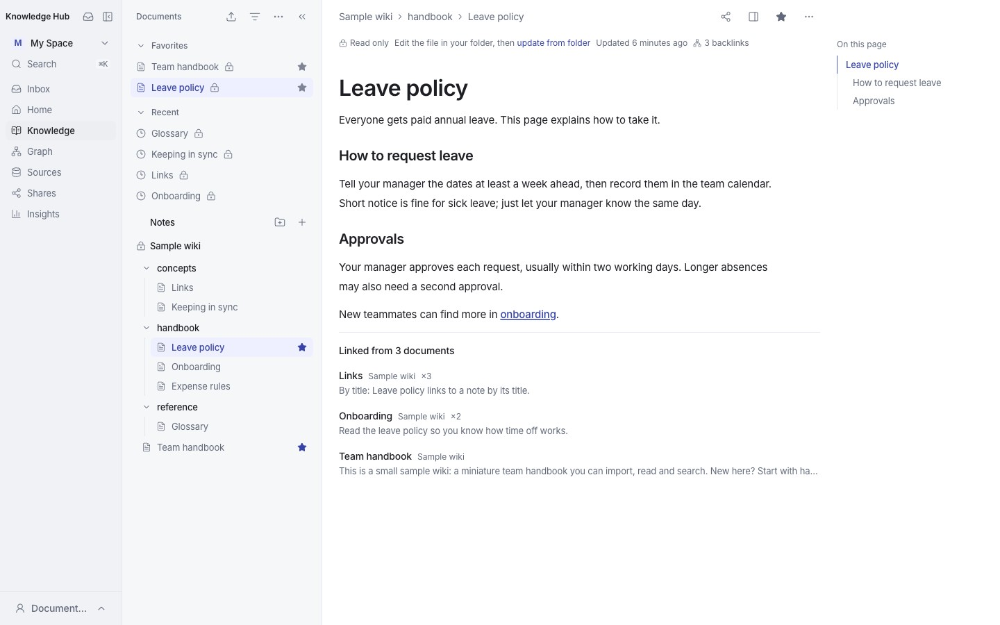
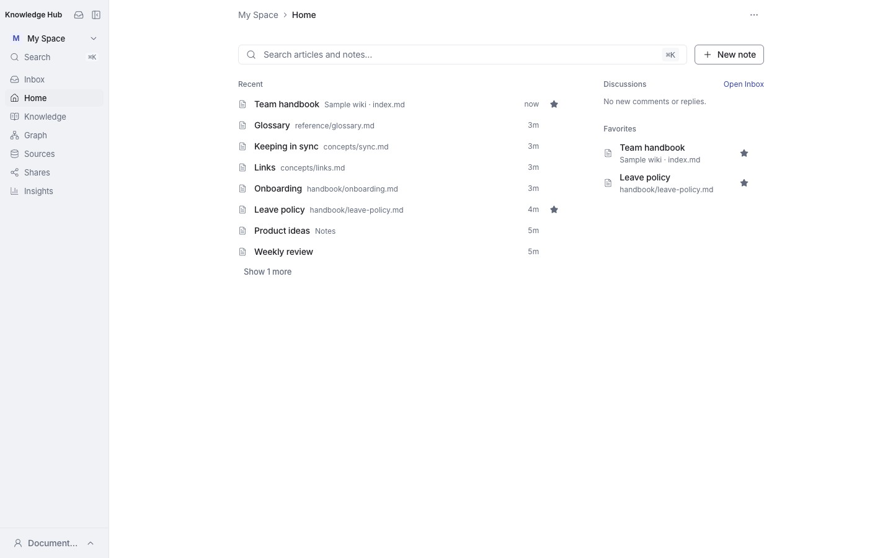
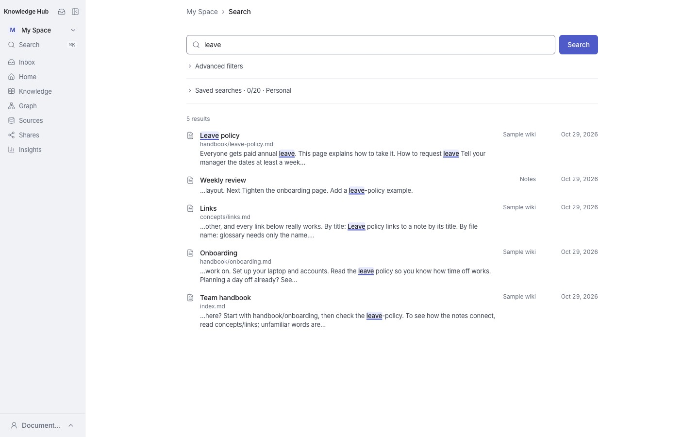
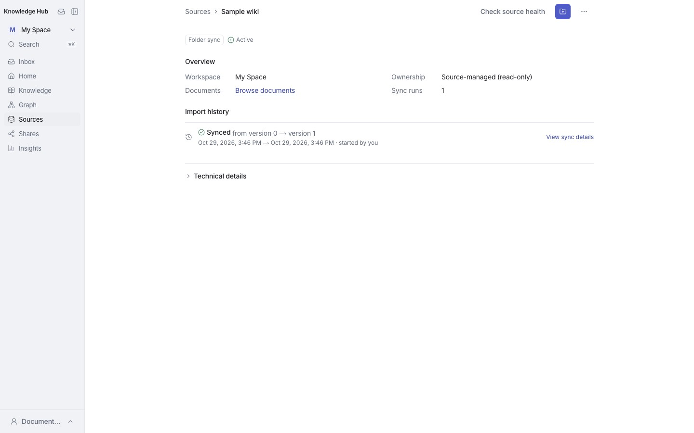
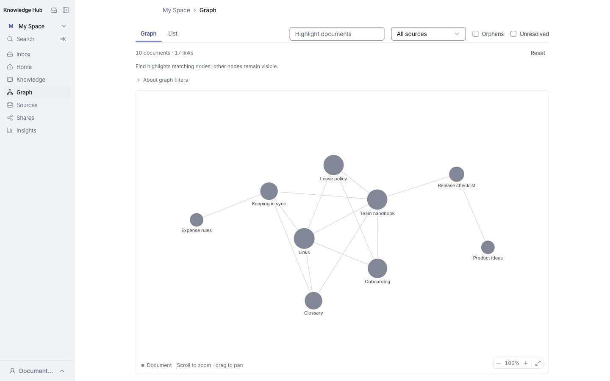

<div align="center">


**Turn Markdown notes into a knowledge workspace you can read, connect, and share.**

[](https://github.com/mike840609/knowledge-hub/actions/workflows/phase2-dev-gate.yml)
[](LICENSE)
[](package.json)
[](.node-version)
<br>
[](https://nextjs.org)
[](https://react.dev)
[](https://www.typescriptlang.org)
[](https://mariadb.org)
[](https://tailwindcss.com)

**English** · [繁體中文](README.zh-TW.md)

[Quick start](#quick-start) · [Features](#features) · [Configuration](#configuration) · [Deployment](#deployment) · [Development](#development-and-testing) · [Contributing](CONTRIBUTING.md)

<br>



</div>

---

Knowledge Hub is an open-source, self-hosted knowledge workspace. Write notes in the browser, or import an existing Markdown folder or LLM Wiki. Find content through search, follow links and backlinks, explore a knowledge graph, discuss shared documents, and export what you need.

Your content stays in plain Markdown — no particular note-taking app, wiki generator, or external knowledge platform required.

> [!NOTE]
> Knowledge Hub is at **0.1.0 and under active development**. The personal workspace, **My Space**, is available by default; Team workspaces are opt-in. Development uses a local demo identity, and production deployments must integrate a trusted identity provider — see [Deployment](#deployment).

## Highlights

- **Markdown in, Markdown out** — import folders with a reviewable Preview → Apply flow, and export individual files or a whole My Space as a ZIP.
- **Connected knowledge** — `[[wikilinks]]`, relative `.md` links, backlinks, and workspace and local graphs.
- **Fast retrieval** — workspace search with source, path and date filters, plus a `⌘K` / `Ctrl+K` palette.
- **Share and discuss** — expiring, revocable read-only links for documents, folders and Sources, with passage-level discussions.
- **Agent-ready** — Copy for Agent, and scoped read APIs that follow the same access rules as the web app.
- **Self-hosted** — a Next.js server and MariaDB that you run and own.

## Screenshots

<table>
  <tr>
    <td width="50%" valign="top">
      
      <p><b>Personal home</b> — drafts, recent documents, discussions and favorites, with Search and New note in reach.</p>
    </td>
    <td width="50%" valign="top">
      
      <p><b>Search</b> — search the whole workspace and narrow results by source, path and update date.</p>
    </td>
  </tr>
  <tr>
    <td width="50%" valign="top">
      
      <p><b>Sources and sync history</b> — review a folder's ownership and history, then <b>Update from folder</b> to review changes. A Source can be shared as one link that never exposes its settings, history or assets.</p>
    </td>
    <td width="50%" valign="top">
      
      <p><b>Knowledge graph</b> — explore links between documents, find a note, and filter by source or unresolved targets.</p>
    </td>
  </tr>
</table>

<sub>Captured on October 29, 2026 (Asia/Taipei) from a production build of commit <a href="https://github.com/mike840609/knowledge-hub/commit/ba699b4e37ed5fdc22f3633e468aff6ef5a1704d"><code>ba699b4e</code></a> at 1440 × 900, using a demo account, the bundled English sample wiki and synthetic notes. Below 1280px the explorer becomes a drawer; below 1024px navigation moves into the Menu drawer. See the <a href="docs/images/README.md">capture provenance</a>.</sub>

## Features

| Feature | What it provides |
| --- | --- |
| **Personal workspace** | My Space, Home, Inbox, personal notes, drafts, favorites, and recently read documents; reading history stays on the device |
| **Inbox** | Unread updates and activity; at wide widths the selected discussion opens beside the list for reply, resolve and hide |
| **Markdown editing** | Rendered editing and Markdown source modes, slash insertions, tables, toggles, callouts, code blocks, an outline, and keyboard shortcuts |
| **Drafts and revisions** | Account-backed autosave, local recovery on failure, immutable revision history, comparison and restore, and stale-editor conflict checks |
| **Import and sync** | Import a Markdown folder through Preview → Apply; select the folder again to review later changes; exclude paths, inspect source health, and rename a source |
| **Organization** | Document and folder trees, move, rename, archive, and restore; source-managed content is read-only in the Hub |
| **Search and retrieval** | Workspace search with source, path and date filters; quick search and recent documents in the `⌘K` / `Ctrl+K` palette; saved searches |
| **Knowledge links** | `[[wikilinks]]`, relative `.md` links, backlinks, and workspace and local graphs |
| **Discussions** | Owner discussions beside the passage, comments on shared pages, replies, resolve and hide, unread notifications, and followed discussions |
| **Sharing** | Anonymous read-only My Space document links with expiry and revocation; permanent links named for chosen signed-in people; recipient-owned saved shares; owner moderation |
| **Export** | Individual Markdown downloads and a My Space ZIP with directory structure and a stable ID/path manifest |
| **Agent context** | Copy for Agent and workspace-scoped read/context APIs that follow the application's access rules, including discussions |
| **Team workspaces** *(opt-in)* | Workspace administration, membership, roles and capabilities, external group mapping, and audit records |

### Content ownership

- **Folder Sync (`SOURCE_MANAGED`)** — the original folder is the source of truth. Edit the original Markdown files, generate a new preview, and apply it. The Hub does not edit synced content directly or watch your local folder in the background.
- **Web Create / individual Upload (`HUB_MANAGED`)** — the Hub manages the content after creation or upload. Edit it in the browser; saving creates a new revision.

A preview is a fixed, staged snapshot. Resolve blocking diagnostics before applying it. If the source version changes, Apply returns a conflict and you must generate a new preview.

### Current limitations and future direction

- Assets store metadata and references only; there is no binary attachment storage yet. Local images and attachments are not guaranteed to open online.
- ZIP exports include the latest saved versions of archived documents, but exclude drafts, revision history, and attachment bytes. The limit is 64 MiB / 9,999 documents.
- Documents use archive and restore for their lifecycle; there is no general end-user permanent deletion.
- Search is keyword-based. An MCP server, semantic/hybrid retrieval, and advanced agent memory are future directions, not shipped features.
- Team workspaces display **Coming soon** by default. Enabling the feature flag does not complete production identity integration.
- Discussion writes are separately gated by `KM_REVIEW_WRITES_ENABLED`. Existing discussion reads and owner moderation remain available when writes are off.
- Hiding a discussion does not physically erase stored data.

## Quick start

### Prerequisites

| Requirement | Notes |
| --- | --- |
| Node.js **≥ 20.19.0, < 25** | [`.node-version`](.node-version) specifies 24.19.0 |
| pnpm 12 | Default for local development; npm is the fallback (see [Local pnpm](#local-pnpm)) |
| Docker + Compose v2 | Must support `up --wait`; runs MariaDB 10.11 |
| `make`, Git | Without `make`, use the steps below |

```bash
git clone https://github.com/mike840609/knowledge-hub.git
cd knowledge-hub
make bootstrap
make dev
```

Open **http://127.0.0.1:3000/** to enter My Space.

`make bootstrap` uses pnpm when pnpm 12 is installed and falls back to `npm ci`. It installs dependencies, copies `.env.example` to `.env` if none exists (an existing `.env` is preserved), starts the database, runs migrations, and loads development fixtures. The example database credentials are for local development only.

<details>
<summary><b>Without make</b></summary>

```bash
pnpm install
cp .env.example .env  # First setup only; preserve and review an existing .env
docker compose up -d --wait mariadb
pnpm run db:migrate
pnpm run db:seed
pnpm run dev
```

If pnpm is unavailable, run `rm -rf node_modules .next && npm ci` instead of `pnpm install`.

</details>

### Your first workflow

1. Choose **New note** to write a note, or **Import folder** to bring in a Markdown folder. The import page links to the folder format guide and offers **Try with a sample wiki**, which imports a ready-made folder (English or Traditional Chinese, from `public/sample-wiki/`) through the normal Preview → Apply flow.
2. For imports, review additions, updates, archives, and diagnostics in Preview before applying.
3. Use `[[Document title]]` in editable notes to link documents, then open **Graph** to explore relationships.
4. Save a note before creating a read-only share link or downloading its Markdown.
5. When your local source changes, select the folder again and follow Preview → Apply.

### User guide

Open the account menu at the bottom of the sidebar and select **Help & guides** (`/help`; the folder format reference is at `/help#format-reference`). The in-app English and Traditional Chinese manual covers first import, repeat sync, permissions and recovery, reading, search, Insights, sharing, discussions and export. Preview and sync errors link to the relevant sections.

Both languages live in `src/components/help/user-guide-content.ts`; update them together when workflows change.

## Configuration

See [`.env.example`](.env.example) for local settings and import limits. Restart the application after changing server environment settings.

| Setting | Purpose / default |
| --- | --- |
| `KM_DB_HOST` / `KM_DB_PORT` | MariaDB address; locally `127.0.0.1:3307` |
| `KM_DB_USER` / `KM_DB_PASSWORD` / `KM_DB_NAME` | Application database credentials and database name |
| `KM_DB_URL` / `KM_DB_SSL` | Deployed database URL and TLS mode; preferred over the individual `KM_DB_*` values |
| `KM_LOCAL_IDENTITY_ENABLED` | Local development identity; `true` in the example |
| `KM_LOCAL_ID` / `KM_LOCAL_EMP_ID` / `KM_LOCAL_NAME` / `KM_LOCAL_ORG_CODE` | Server-configured local identity, rather than a login form |
| `KM_TEAM_WORKSPACES_ENABLED` | Defaults to `false`; set to `true` to enable Team navigation and access |
| `KM_IDENTITY_PROVIDER` | `local` by default; production uses `company-sso` with a session reader, or `google` for the demo login |
| `KM_REVIEW_WRITES_ENABLED` | Defaults to `false`; enables new discussion threads and replies |
| `KM_PUBLIC_ORIGIN` | Browser-facing origin when the Hub sits behind a Gateway or reverse proxy; required for discussion requests there |
| `KM_SITE_PASSWORD` | Optional site password for a single-operator Vercel deployment |
| `KM_IMPORT_*` | Import file counts, sizes, batch limits, and snapshot quotas |
| `KM_TEST_DB_*` / `KM_E2E_DB_PREFIX` | Isolated test database settings; the test account must be able to create and drop databases with the designated prefixes |

Default import limits include 20,000 manifest entries, 3.5 MiB per Markdown file, and 256 MiB of Markdown in total. Snapshot retention is 2 hours for `BUILDING`, 30 minutes for `READY`, and 24 hours for `STALE` / `APPLIED`. The server deletes expired staging data in the background when someone starts an import, at most once every 10 minutes per process. To clean up on demand (for example, on an instance nobody imports into):

```bash
npx tsx scripts/db/cleanup-import-snapshots.ts
```

This removes import staging data only and preserves canonical document history.

## Deployment

Knowledge Hub runs a Next.js server with MariaDB. `compose.yaml` provides a development database, not a complete production deployment.

```bash
npm ci
npm run db:migrate
npm run build
npm run start
```

> [!IMPORTANT]
> **Complete identity integration before running in production.** `npm run start` runs in production mode, which rejects the default Local identity provider. `KM_ALLOW_LOCAL_IDENTITY_IN_PRODUCTION` exists for testing and must not be used as a deployment method.

**Deployment paths**

- **Single operator on Vercel** — follow the [Vercel + Layerbase runbook](docs/operations/vercel-layerbase.md). It keeps the local identity provider behind an optional site password, runs migrations during production builds, and disables preview deployments. Do not use it for a shared or company deployment.
- **Public demo** — the same runbook documents [Google demo login](docs/operations/vercel-layerbase.md#google-demo-login): set `KM_IDENTITY_PROVIDER=google` and the `AUTH_*` variables. It is additive; the local and company-SSO paths are unchanged.
- **Company SSO** — implement a trusted [`CompanySsoSessionReader`](src/modules/identity/ports/company-sso-session-reader.ts) and register it through [`configureCompanySsoSessionReader`](src/server/composition.ts) before application services are created. Setting `KM_IDENTITY_PROVIDER=company-sso` alone provides no login page or identity service.

<details>
<summary><b>Company SSO integration details</b></summary>

The reader must return the company account name as `account` and the optional English display name as `name_en`, alongside the subject, employee id, name, org code, and group IDs.

Shared-page **Open in Knowledge Hub** and **Get started** links navigate to `KM_PUBLIC_ORIGIN` with a full browser navigation when it is configured, so the company Gateway at that origin can challenge anonymous users for SSO. The entry URL carries `returnTo=/s/:token/open`; the Gateway must preserve this query string through SSO. After authentication, the Hub accepts only a share-opening path and resumes the existing link-validity and document-access checks. Invalid or absent continuation parameters fall back to the ordinary home destination. Without `KM_PUBLIC_ORIGIN`, these links keep the local `/s/:token/open` flow.

</details>

**Production checklist**

- Separate database credentials, backups, HTTPS, and a trusted session integration. Never expose example development credentials or test settings.
- The `start` script binds to `127.0.0.1`, suitable for a reverse proxy on the same host. Container deployments need an appropriate bind address in their startup command.
- **Try with a sample wiki** fetches static files from `/sample-wiki/*`, so a reverse proxy or SSO allow-list must serve that path to signed-in users. The URLs are absolute, so a Next.js `basePath` is not supported.
- Before upgrading an existing database, read the [workspace governance cutover guide](docs/operations/phase3-workspace-governance-cutover.md); some migrations enforce data readiness gates. Use the [document link index rollout guide](docs/operations/document-link-index-rollout.md) to backfill or repair links with `npm run db:reindex-document-links`, and [Team workspace availability](docs/operations/team-workspaces-availability.md) for feature flag operations.

### Document review deployment

Discussions are stored separately from Markdown and Folder Sync. `KM_REVIEW_WRITES_ENABLED` defaults to off; existing discussion reads and owner moderation remain available while new threads and replies are disabled. Behind a Gateway or reverse proxy, set `KM_PUBLIC_ORIGIN` to the origin browsers use (for example `https://km.example.com`); without it every discussion request is refused as cross-origin. Company SSO/Gateway and login continuation require separate corporate integration evidence before production writes are enabled. Hiding content does not physically erase stored data.

[Inline review design](docs/superpowers/specs/2026-10-09-shared-personal-document-inline-review-design.md) · [Implementation plan](docs/superpowers/plans/2026-10-09-shared-personal-document-inline-review.md) · [Verification](docs/superpowers/verification/2026-10-09-shared-personal-document-inline-review.md)

## Architecture

| Layer | Technology |
| --- | --- |
| Web application | Next.js 15, React 19, TypeScript |
| UI | Tailwind CSS, Base UI, Lucide icons |
| Markdown | Milkdown, react-markdown, remark-gfm |
| Knowledge graph | d3-force |
| Database | MariaDB 10.11 |
| Testing | Vitest, Playwright |

The application is a modular monolith. Its modules — `identity`, `workspaces`, `sources`, `knowledge`, `personal` and `task-knowledge` — keep domain rules free of I/O, and web pages and APIs share the same application services. Module boundaries are enforced by lint rules.

```text
User → WorkspaceMembership → Workspace
                                └── KnowledgeSource
                                      ├── Folder / Document tree
                                      ├── Asset metadata / references
                                      └── KnowledgeDocument (stable ID)
                                            └── KnowledgeRevision (immutable)
```

A workspace is both a knowledge container and the basic access boundary. Organizational attributes do not grant access, and knowing a document ID does not authorize reading it. Public share links are explicitly created, revocable, read-only entry points.

```text
src/app/             Next.js pages and HTTP routes
src/components/      UI, shell, composer, reader, review, and graph
src/modules/         Domain, application services, and ports
src/infrastructure/  MariaDB repositories and identity adapters
src/server/          Request composition and server-side read models
src/lib/             Shared client and server helpers
src/shared/          Cross-module domain primitives
scripts/             Migrations, seeds, maintenance, and test runners
tests/               Unit, integration, E2E, and fixtures
docs/                Design, operations, and verification records
```

## Development and testing

| Command | Purpose |
| --- | --- |
| `make dev` | Start the local development server |
| `make dev-reviewer` | Start a second server as another local user on port 3001, for [two-person flows](docs/development/two-person-demo.md) |
| `make build` / `make start` | Build / serve a production build (requires identity integration) |
| `make db-up` / `make db-down` / `make db-logs` | Start, stop, or inspect the database; `db-down` preserves the volume |
| `make db-migrate` / `make db-seed` | Update the schema / load development fixtures |
| `make db-reindex-links` | Backfill or repair the derived document link index |
| `make test-unit` | Unit tests without a database |
| `make test-integration` | Database integration tests; the runner creates and removes isolated databases |
| `make browsers` | Install Chromium for E2E tests on first use |
| `make test-e2e` | Provision an isolated database, build production assets, and run browser tests |
| `make guide-screenshots` | Regenerate the in-app user guide screenshots from the sample wiki |
| `make test-mermaid-assumptions` | Check in Chromium what the reader assumes of Mermaid; run before changing its version |
| `make verify` | Unit tests, TypeScript, lint, and build |
| `make help` | List all make commands |

```bash
make verify
make test-integration
make browsers
npm run test:e2e:smoke
npm run test:e2e:smoke:personal
```

The full E2E suite enables Team mode by default. Run the personal rollout separately:

```bash
npm run test:e2e
KM_E2E_PERSONAL_ONLY=true npm run test:e2e -- personal-workspace.spec.ts
```

The test runner manages its own mode and required servers rather than inheriting the Team default from `.env`. Reports are written to `playwright-report/e2e-runs/<suite>/<UUID>/` and `test-results/`, and are excluded from Git. Specs that take comparison screenshots also write them to `test-results/ui-comparisons/`; the tracked before/after evidence under `docs/ui-comparisons/` is rewritten only with `KM_UPDATE_UI_COMPARISONS=1`. See the [E2E coverage matrix](docs/superpowers/verification/2026-10-02-e2e-coverage-matrix.md).

### Local pnpm

pnpm 12 is the default local package manager; `pnpm-workspace.yaml` and `pnpm-lock.yaml` are committed. npm is the fallback when pnpm is unavailable, and remains the package manager for CI, Vercel, and deployment (`npm ci`, `package-lock.json`). Install pnpm with `brew install pnpm` (or `npm install -g pnpm@12`) and confirm `pnpm -v` reports 12.x.

<details>
<summary><b>Required settings, lockfiles, and install caveats</b></summary>

The committed `pnpm-workspace.yaml` carries three required settings:

```yaml
packageImportMethod: clone-or-copy
publicHoistPattern:
  - '*'
allowBuilds:
  esbuild: true
  fsevents: true
  unrs-resolver: true
```

- `packageImportMethod: clone-or-copy` is required: without it pnpm may hardlink packages from the shared store, and `patch-package` would then modify that store for every project that uses it. The `pnpm store status` note below only holds with this setting.
- `publicHoistPattern` matches the root hoisting this repository relies on: it imports `mdast-util-to-hast`, `mdast-util-gfm`, and `@next/eslint-plugin-next` without declaring them; declaring them is the durable fix.
- `allowBuilds` names the dependencies allowed to run build scripts. If pnpm warns that build scripts were ignored (or reports `ERR_PNPM_IGNORED_BUILDS` with `strictDepBuilds`), add the named package after confirming it is expected, or run `pnpm approve-builds`.

If you created either file locally before it was tracked, remove its `.git/info/exclude` entry so Git picks up the committed copy.

Install with `pnpm install`; it runs the same `patch-package` postinstall as npm. On filesystems with clone/reflink support (APFS, Btrfs), worktrees also share disk blocks; on copy-only filesystems pnpm falls back to copies and the disk saving shrinks.

The npm fallback needs the npm layout: `rm -rf node_modules .next && npm ci`. Switch back with `rm -rf node_modules .next && pnpm install`; the layouts are not interchangeable.

**When dependencies change**, keep both lockfiles in step. `package-lock.json` is what CI, Vercel, and deployment resolve, so refresh it first with `npm install --package-lock-only`, then derive `pnpm-lock.yaml` with `pnpm import && pnpm install`, and commit both. `pnpm import` prefers the versions recorded in `package-lock.json`; confirm `next` still resolves to 15.5.25 while `patches/next+15.5.25.patch` is in use.

**Do not pass `--ignore-scripts`** to `pnpm install`: it skips both the dependency build scripts and the `postinstall` that applies the Next.js patch. If you already did, a plain `pnpm install` reports "Already up to date" and does not rerun the root `postinstall`; run `pnpm install --force` (or `rm -rf node_modules .next && pnpm install`). To restore the skipped dependency builds and the patch separately, run `pnpm rebuild && pnpm exec patch-package`. In a patched layout, `pnpm store status` exits non-zero with `ERR_PNPM_MODIFIED_DEPENDENCY` for `next`; that is expected, and with `clone-or-copy` the shared store itself is not changed.

</details>

### Next.js patch

The install postinstall step uses `patch-package` to apply [`patches/next+15.5.25.patch`](patches/next+15.5.25.patch), which fixes two bugs in Next.js's bundled React (`19.2.0-canary-0bdb9206-20250818`):

1. Lost render pings during page navigation.
2. A page crash with "Application error" (React #310, "Rendered more hooks than during the previous render", thrown from Next's `Router`) when a redirect or other error lands during render while another navigation is still loading — for example, clicking a document while "Browse documents" is still redirecting. Without the fix, React's error recovery commits the Router half-rendered; the patch adds the one condition from [facebook/react#36911](https://github.com/facebook/react/pull/36911) to the four `react-dom` client and profiling builds.

<details>
<summary><b>Restoring, verifying, and upgrading</b></summary>

Keep install scripts enabled. After an npm install made with `--ignore-scripts`, run `npm ci`; after a pnpm one, run `pnpm install --force` (a plain `pnpm install` will not rerun the root `postinstall` on an up-to-date tree). To restore only the patch, use `pnpm exec patch-package` on a pnpm layout or `npx patch-package` on an npm layout.

The second fix was checked against the upstream diff of #36911, and [vercel/next.js#95368](https://github.com/vercel/next.js/pull/95368) brings it into Next canary (React `ec0fca31-20260701`). The issues those PRs reference (vercel/next.js#63121 and #78396, facebook/react#33580) were read only as summaries and were not reproduced here. The `experimental` React channel under `next/dist/compiled/react-dom-experimental` is unpatched: it is only loaded when experimental React features are enabled in `next.config.ts`, which this project does not do.

When upgrading Next.js, check whether the patch is still required: [`vendored-react-ping-fix.test.ts`](tests/unit/vendored-react-ping-fix.test.ts) checks the bundled source for both fixes, and passes without the patch once Next bundles a React that already has them. [`router-redirect-during-navigation.spec.ts`](tests/e2e/router-redirect-during-navigation.spec.ts) reproduces the crash in the browser; evidence is in the [verification record](docs/superpowers/verification/2026-10-06-react-310-redirect-recovery-verification.md). After updating or removing the patch, clear `.next/cache` before rebuilding.

</details>

### Mermaid version

`mermaid` is pinned to `~12.2.0`. The reader draws a diagram only if its type is on an allow-list, with a list of config keys a diagram's own text may not set and a sanitiser configuration of its own ([`mermaid-queue.ts`](src/components/knowledge/mermaid-queue.ts)); each exists because of what that version was seen to do in a browser. Before changing the version, and again after, run:

```bash
make test-mermaid-assumptions
```

[`scripts/test/mermaid-assumptions.mjs`](scripts/test/mermaid-assumptions.mjs) lays every listed type out in Chromium with hostile text, under the production policy's fetch directives, and exits non-zero when an assumption no longer holds. It is not part of `make verify` or CI. The [spec](docs/superpowers/specs/2026-10-13-reader-mermaid-design.md) explains what each assumption guards.

## Troubleshooting

| Symptom | Fix |
| --- | --- |
| Database connection fails | Check Docker, `make db-logs`, and the credentials in `.env`. The local database uses port 3307, the dev server 3000, and E2E 3101 by default. |
| Team navigation is unavailable | **Coming soon** is the default. Set `KM_TEAM_WORKSPACES_ENABLED=true` and restart. |
| Production identity error | Local identity does not provide production login. Integrate an SSO session reader or use the documented Google demo provider. |
| Import cannot be applied | Resolve blockers in Preview. A 409 version conflict requires a new preview; there is no Force Apply. |
| Links or graph entries are missing | Ensure migrations are complete, then run `make db-reindex-links`. Fix wikilinks in synced documents at the original source. |
| Comments cannot be added | Set `KM_REVIEW_WRITES_ENABLED=true` and restart. Behind a Gateway, also set `KM_PUBLIC_ORIGIN`. |
| Resetting development data | `make db-reset` deletes the development database volume and all its contents. Back up anything you need first. |

## Documentation

English is the primary documentation language. Each project Markdown guide links to its Traditional Chinese companion (`*.zh-TW.md`). Some originally English historical documents keep their full English technical text beneath a Chinese reading guide; those companions say so explicitly.

- [Operations guides](docs/operations/) — database upgrades, Team availability, deployment, and index maintenance
- [Design specifications](docs/superpowers/specs/) and [implementation plans](docs/superpowers/plans/) — behavior contracts and design decisions
- [Verification records](docs/superpowers/verification/) — testing and inspection evidence for individual features
- [Phase roadmap](docs/superpowers/roadmaps/2026-09-10-knowledge-hub-phase-roadmap.md), [action model](docs/superpowers/specs/2026-09-21-action-model-spec.md), [keyboard shortcuts](docs/superpowers/specs/2026-09-24-keyboard-shortcuts-design.md), [row keyboard actions](docs/superpowers/specs/2026-10-02-row-keyboard-actions-design.md), and the undated [frontend design language](docs/superpowers/specs/frontend-design-language.md), updated in place

Historical designs and roadmaps preserve development context and may describe features that are unimplemented or have since changed. Current source code and tests define shipped behavior.

<details>
<summary><b>Current canonical documents</b></summary>

These documents define the core contracts and their implementation plans. Later focused specifications record additions; dated verification records describe evidence at that point in time.

| Area | Design | Plan | Scope |
| --- | --- | --- | --- |
| Foundation and architecture | [Spec](docs/superpowers/specs/2026-09-10-phase-0-foundation-architecture-design.md) | [Plan](docs/superpowers/plans/2026-09-10-phase-0-foundation-implementation.md) | Module boundaries, schema, transactions and workspace access. |
| Knowledge core and tree | [Spec](docs/superpowers/specs/2026-09-10-phase-1-knowledge-core-tree-design.md) | [Plan](docs/superpowers/plans/2026-09-10-phase-1-knowledge-core-tree-implementation.md) | Document identity, revisions, tree placement and lifecycle. |
| Folder import and sync | [Spec](docs/superpowers/specs/2026-09-12-phase-2-knowledge-source-import-sync-design.md) | [Plan](docs/superpowers/plans/2026-09-12-phase-2-knowledge-source-import-sync.md) | Staging, Preview, atomic Apply and source ownership. |
| Identity and workspace governance | [Spec](docs/superpowers/specs/2026-09-14-phase-3-identity-workspace-governance-design.md) | [Plan](docs/superpowers/plans/2026-09-14-phase-3-identity-workspace-governance.md) | Roles, capabilities, membership, SSO and cutover. |
| Discovery and read API | [Spec](docs/superpowers/specs/2026-09-16-phase-4-discovery-read-api-design.md) | [Plan](docs/superpowers/plans/2026-09-16-phase-4-discovery-read-api.md) | Authorized search and bounded document reads. |
| Human authoring | [Spec](docs/superpowers/specs/2026-09-16-phase-5-human-authoring-design.md) | [Plan](docs/superpowers/plans/2026-09-16-phase-5-human-authoring.md) | Upload, create, edit and revision conflicts. |
| Document sharing | [Spec](docs/superpowers/specs/2026-09-23-document-share-link-design.md) | [Plan](docs/superpowers/plans/2026-09-23-document-share-link.md) | Expiring, revocable single-document read access. |
| Inline document review | [Spec](docs/superpowers/specs/2026-10-09-shared-personal-document-inline-review-design.md) | [Plan](docs/superpowers/plans/2026-10-09-shared-personal-document-inline-review.md) | Anonymous discussion reads, authenticated writes, owner moderation and sync-safe anchors; corporate rollout gated. |
| Owner comments rail | [Spec](docs/superpowers/specs/2026-10-12-owner-comments-rail-design.md) | — | The owner's discussions beside the passage they are about, in the outline's place; a drawer where the pane is narrow. |
| Review anchors and owner threads | [Spec](docs/superpowers/specs/2026-10-13-review-anchors-and-owner-threads-design.md) | — | Comments on table cells and code; a selection that cannot take one says why; the owner starts a discussion; a callout, task list or footnote no longer disables commenting. |
| Saved shares | [Spec](docs/superpowers/specs/2026-10-12-saved-shares-design.md) | [Plan](docs/superpowers/plans/2026-10-12-saved-shares.md) | Account-backed recipient bookmarks, separate from favorites; access remains controlled by the original link. |
| Folder share link | [Spec](docs/superpowers/specs/2026-10-29-folder-share-link-design.md) | [Plan](docs/superpowers/plans/2026-10-29-folder-share-link.md) | One expiring, revocable link to a My Space folder's live subtree: a tree beside the reader, in-folder links followed, the rest left as text; comments, saving and the owner's Inbox work as for a document link. |
| Source share link | [Spec](docs/superpowers/specs/2026-11-05-source-share-link-design.md) | [Plan](docs/superpowers/plans/2026-11-05-source-share-link.md) | Share one My Space Source's live document tree without exposing its settings, history or assets. |
| Named-recipient share | [Spec](docs/superpowers/specs/2026-11-03-named-recipient-share-design.md) | — | A share link with a named audience: it opens only for the signed-in people its owner lists, is read in the Hub rather than on `/s/:token`, never expires, and grants nothing beyond a link. |
| Followed discussions | [Spec](docs/superpowers/specs/2026-10-23-followed-discussions-tab-design.md) | [Plan](docs/superpowers/plans/2026-10-23-followed-discussions-tab.md) | Shares → Discussions lists the discussions a reader follows; a reader drops their own follow without a live link. |
| Reader callouts | [Spec](docs/superpowers/specs/2026-10-12-reader-callouts-design.md) | — | `> [!NOTE]` and GitHub's four other kinds drawn as callouts in the reader and on shared pages; the stored Markdown is unchanged. |
| Reader HTML subset | [Spec](docs/superpowers/specs/2026-10-12-reader-html-subset-design.md) | — | Seven bare HTML tags drawn in the reader and on shared pages; everything else stays text, and no HTML is ever passed through. |
| Content-Security-Policy | [Spec](docs/superpowers/specs/2026-10-12-content-security-policy-design.md) | — | Scripts run by per-response nonce on every page; no inline script or handler. |
| Mermaid in the reader | [Spec](docs/superpowers/specs/2026-10-13-reader-mermaid-design.md) | [Plan](docs/superpowers/plans/2026-10-13-reader-mermaid.md) | A `mermaid` block drawn as an image in the reader and on shared pages, never as markup; left as code, with a reason, when it cannot be. |
| Editor reader hints | [Spec](docs/superpowers/specs/2026-10-12-editor-reader-hints-design.md) | — | The editor hints at a callout and the inline HTML subset with decorations; the marks stay and the saved Markdown is unchanged. |
| Source tree loading | [Spec](docs/superpowers/specs/2026-10-24-lazy-source-trees-design.md) | [Plan](docs/superpowers/plans/2026-10-24-lazy-source-trees.md) | Current source initially; other trees load on expansion, with retry and shared move-dialog data. |
| Document composer | [Spec](docs/superpowers/specs/2026-09-28-document-composer-design.md) | [Plan](docs/superpowers/plans/2026-09-28-document-composer.md) | Rendered editing and Markdown source mode. |
| Inline editing | [Spec](docs/superpowers/specs/2026-10-16-inline-editing.md) | — | Editing in the reader with autosave and passage discussions; checkpoint history is a follow-up policy. |
| Knowledge links and graph | [Spec](docs/superpowers/specs/2026-09-29-personal-workspace-knowledge-graph-design.md) | [Plan](docs/superpowers/plans/2026-09-29-personal-workspace-knowledge-graph.md) | Wikilinks, backlinks, heading anchors and derived graph data. |
| Personal daily use | [Spec](docs/superpowers/specs/2026-09-29-personal-daily-driver-design.md) | [Plan](docs/superpowers/plans/2026-09-29-personal-daily-driver.md) | Wikilink preservation, completion, code blocks and organization. |
| Personal workspace rollout | [Spec](docs/superpowers/specs/2026-09-30-personal-workspace-design.md) | [Plan](docs/superpowers/plans/2026-09-30-personal-workspace.md) | Account drafts, favorites, revision restoration and export. |
| Task knowledge export | [Spec](docs/superpowers/specs/2026-11-04-task-knowledge-export-design.md) | [Plan](docs/superpowers/plans/2026-11-04-task-knowledge-export.md) | `/hub-export` in Claude Code or OpenCode saves a finished task to My Space through one restricted, revocable binding; manual, idempotent, no MCP. Setup: [task export setup](docs/task-export-setup.md). |
| Agent read access | [Spec](docs/superpowers/specs/2026-11-10-agent-read-access-design.md) | [Plan](docs/superpowers/plans/2026-11-10-agent-read-access.md) | `/hub-search` and `/hub-read` read the owner's active documents and past task results in My Space through the same export token; read only, one My Space, no MCP. |
| Home continue | [Spec](docs/superpowers/specs/2026-10-19-home-continue-design.md) | [Plan](docs/superpowers/plans/2026-10-19-home-continue.md) | Drafts, recent documents and favorites on Home. |
| Discovery and Copy for Agent | [Spec](docs/superpowers/specs/2026-10-04-mvp-discovery-agent-design.md) | [Plan](docs/superpowers/plans/2026-10-04-mvp-discovery-agent.md) | Folder scope, filtered search and reviewed Markdown bundles. |
| Sample wiki and import guide | [Spec](docs/superpowers/specs/2026-10-06-sample-wiki-import-guide-design.md) | [Plan](docs/superpowers/plans/2026-10-06-sample-wiki-import-guide.md) | Bundled bilingual sample wiki and the in-app import guide with live limits. |
| Retrieval-first shell | [Spec](docs/superpowers/specs/2026-10-28-retrieval-first-shell-design.md) | — | The explorer becomes a drawer at 1024–1279px; Favorites and Recent open by default; search stays the primary entry. |
| Google demo login | [Spec](docs/superpowers/specs/2026-10-25-google-login-design.md) | [Plan](docs/superpowers/plans/2026-10-25-google-login.md) | An additive Google provider for the public demo. |
| Vercel + Layerbase deployment | [Spec](docs/superpowers/specs/2026-10-24-vercel-layerbase-deployment-design.md) | [Plan](docs/superpowers/plans/2026-10-24-vercel-layerbase-deployment.md) | Single-operator deployment with a site password and build-time migrations. |
| Source rename | [Spec](docs/superpowers/specs/2026-10-26-source-rename-design.md) | [Plan](docs/superpowers/plans/2026-10-26-source-rename.md) | A source's display label can change without changing its folder identity. |
| Inbox split view | [Spec](docs/superpowers/specs/2026-10-29-inbox-split-view-design.md) | — | A list and the selected discussion beside it at 75rem; narrower windows keep the list. |
| Users account | [Spec](docs/superpowers/specs/2026-10-29-users-account-design.md) | [Plan](docs/superpowers/plans/2026-10-29-users-account.md) | Company SSO account and optional English name stored for future mention autocomplete. |

</details>

## Contributing

Contributions are welcome. Read the [contributing guide](CONTRIBUTING.md) to report issues, propose features, and submit pull requests, and use [GitHub Issues](https://github.com/mike840609/knowledge-hub/issues) for general questions and feature requests.

Please report security vulnerabilities privately as described in [SECURITY.md](SECURITY.md), not in public issues.

## License

Knowledge Hub is released under the [MIT License](LICENSE). You may use, modify, and distribute it, retaining the original copyright and license notices when redistributing. Third-party dependencies retain their respective licenses.
