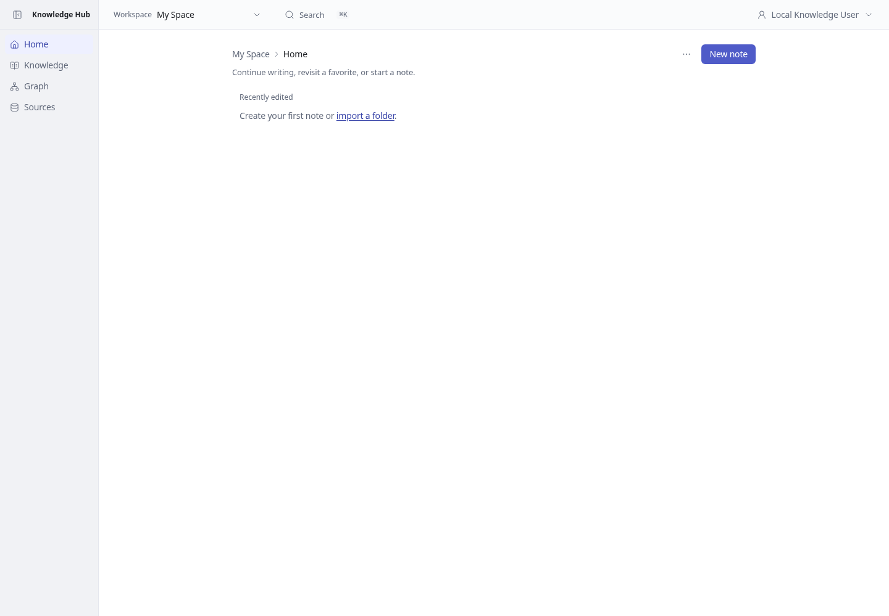
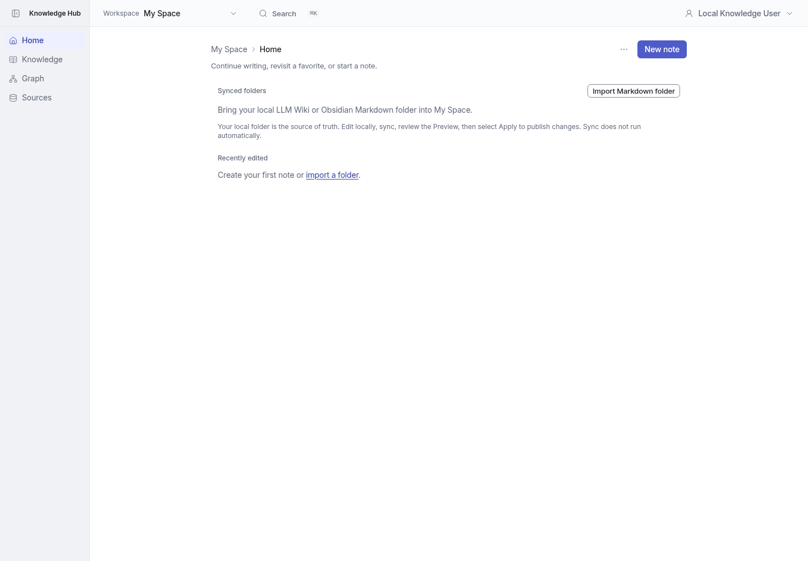
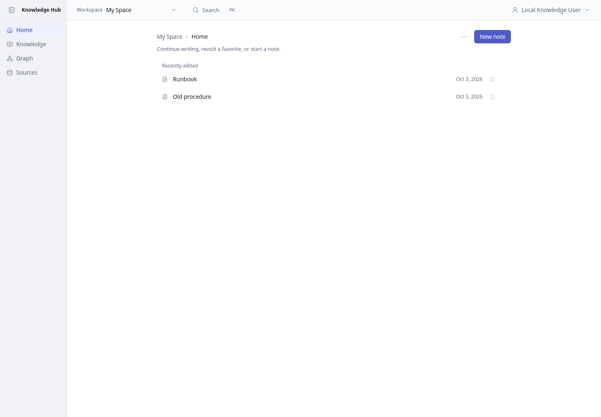
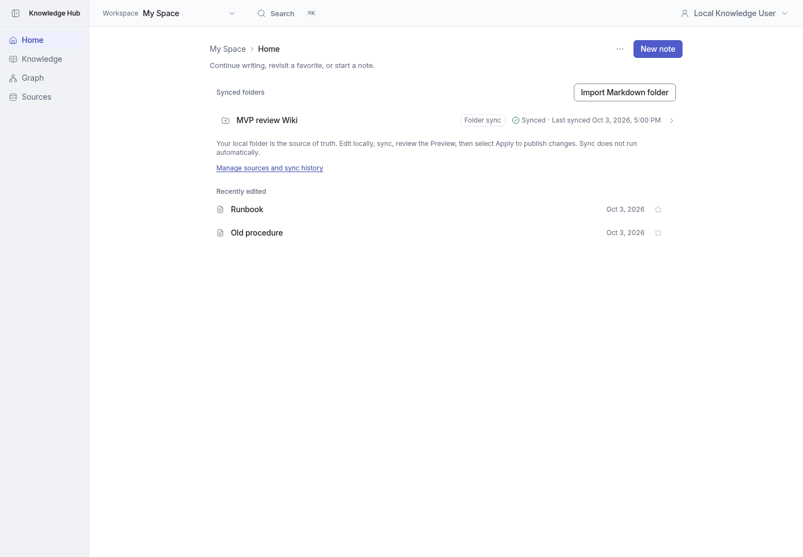
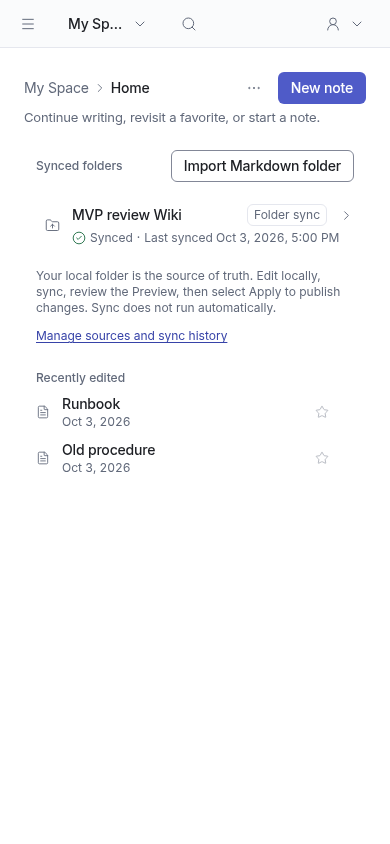

# MVP batch 1 — personal sync home

My Space Home now lists active folder sources, their latest result and last successful Apply, and offers the existing permission-aware Sync now / folder selection action. New users see a direct Markdown-folder import entry and the local edit → Preview → Apply workflow. Hub-authored notes are not presented as synced sources. Sync status remains visible on narrow screens.

## Before / after

Same local development identity and seeded review Wiki, 1440 × 1000, browser timezone Asia/Taipei. Screenshots show test content only.

| State | Before | After |
| --- | --- | --- |
| First-use Home |  |  |
| Home with imported source |  |  |

Mobile result: 

## Verification

- Unit suite: 116 files, 1,609 tests passed.
- Typecheck, lint, production build, diff whitespace check passed.
- Real Chromium: source overview, mobile sync timestamp visibility, and folder-selection fallback navigation passed.
- Independent review found no correctness blockers; its mobile visibility concern was addressed.

No automatic/background sync is introduced; Preview/Apply remains required.
