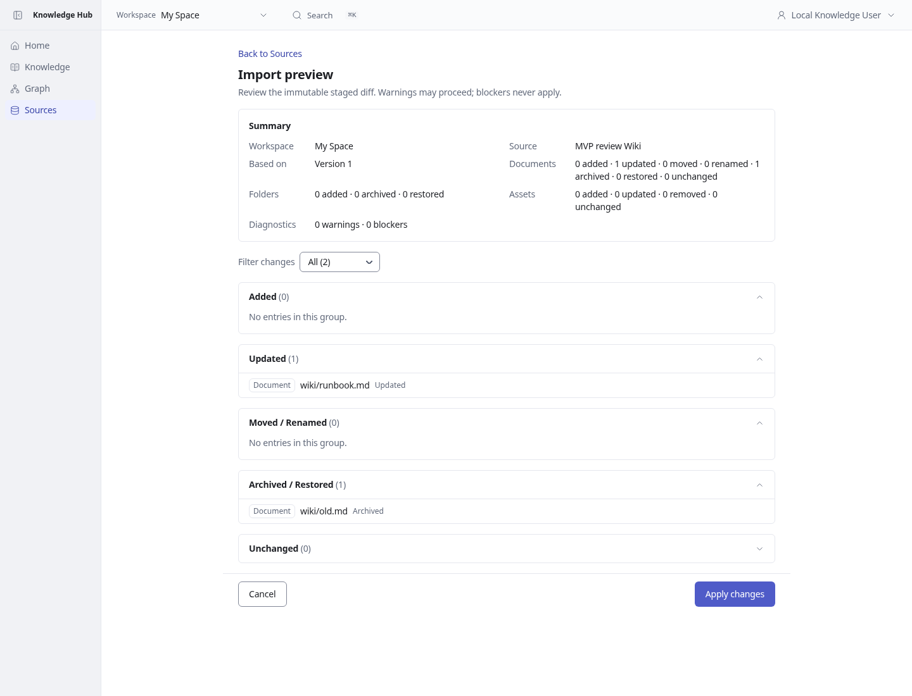
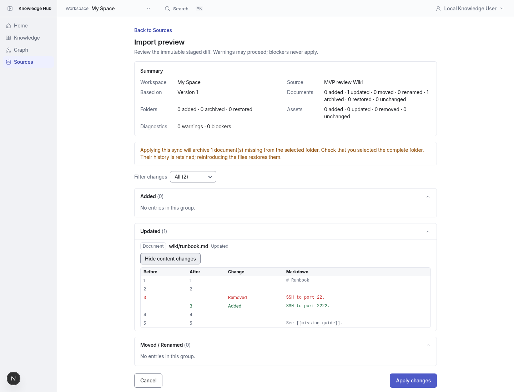

# MVP batch 2 — review sync content before Apply

Existing Preview already supplies per-kind change counts and label filters. This batch adds lazy Markdown content comparisons for updated documents and an explicit reminder when applying the snapshot will archive missing documents.

Content comes from the immutable revision referenced by the saved plan and the staged Markdown that Apply will use, never a reread of the local folder. Snapshot creator and workspace read authorization are checked. Expired, stale and applied snapshots cannot request this comparison. Only the selected file is loaded; changed-line rendering starts at 100 rows with a Show more action.

## Before / after

Same test source and READY snapshot, 1440 × 1100, browser timezone Asia/Taipei.

| Before | After |
| --- | --- |
|  |  |

## Verification

- Unit suite: 117 files, 1,612 tests passed.
- MariaDB integration suite: 53 files, 620 tests passed, including immutable planned/staged comparison and no source-version mutation.
- Typecheck, lint, production build and diff whitespace check passed.
- Real Chromium: before/after screenshots, old/new staged content, collapse and unrelated path denial passed; the preview was not applied.
- Independent review's unbounded lookup/render findings were fixed by plan-path lookup and paginated rendering.

An initial heavily parallel run hit the existing E2E-report unit fixture's 15-second timeout. After stopping screenshot servers, the complete unit suite passed without changing that test or its timeout. The full application Playwright suite was not rerun locally; browser verification focused on the changed flow.
