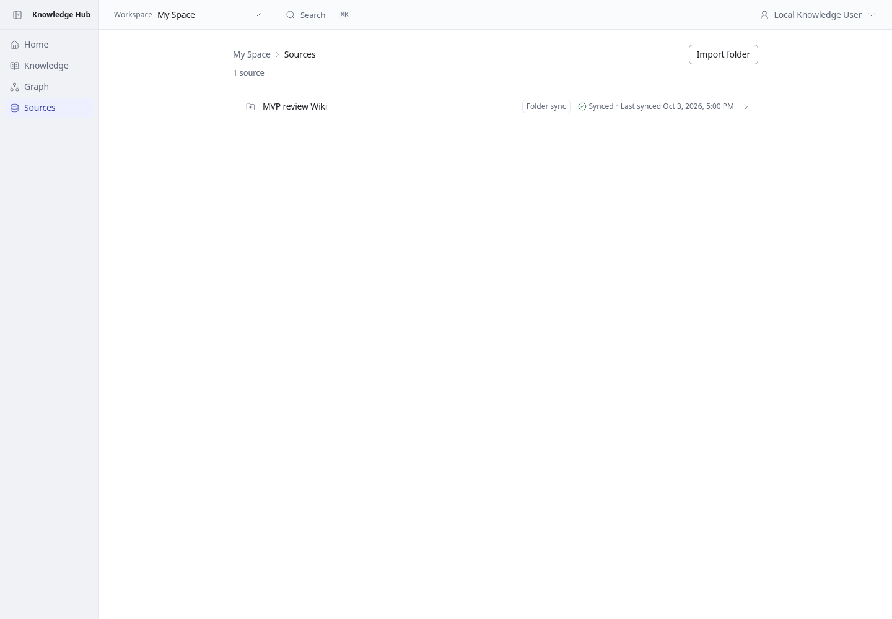
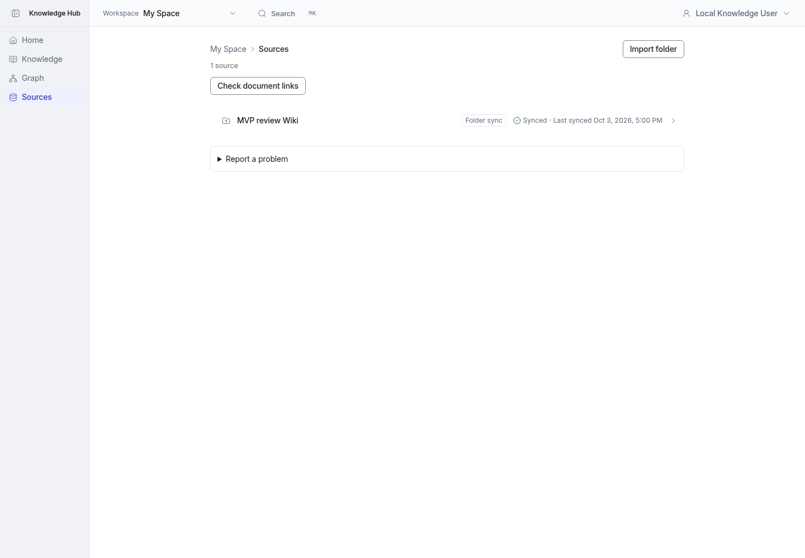
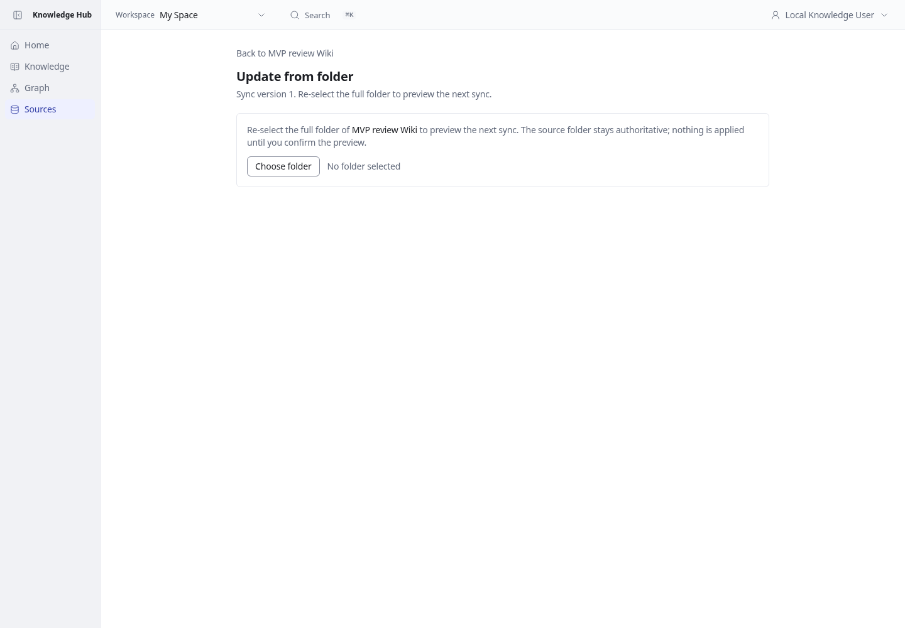
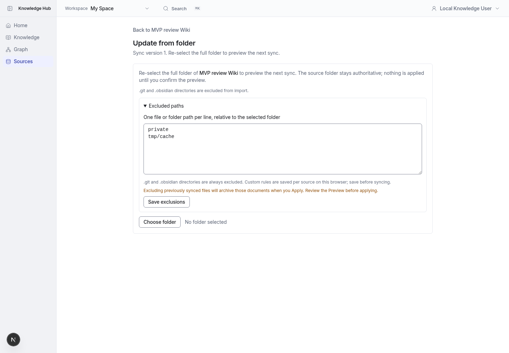
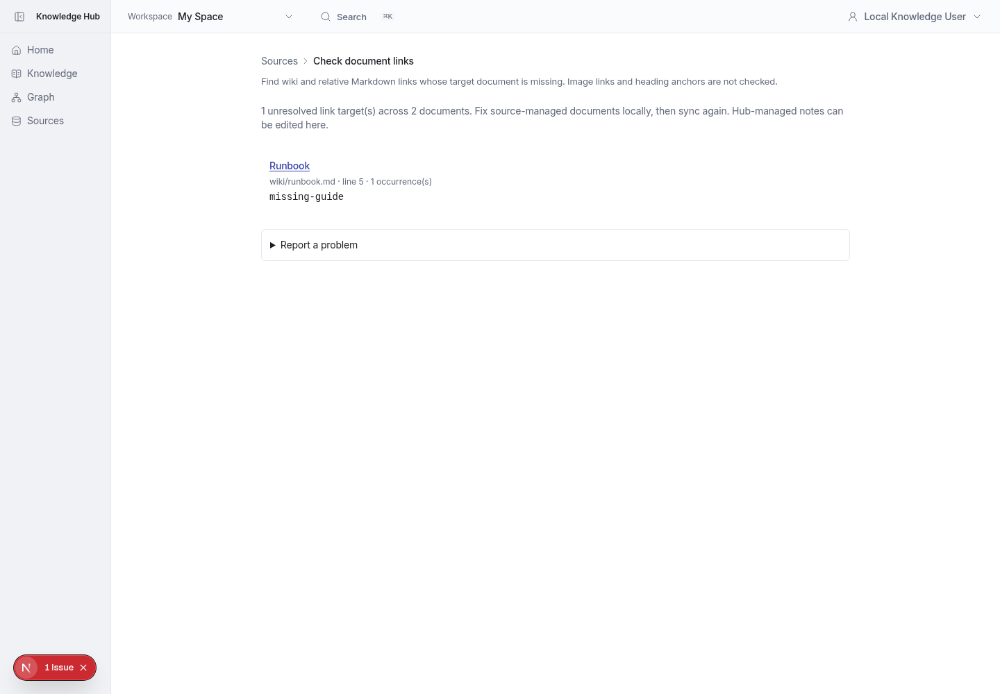

# MVP batch 3 — personal Wiki quality

Personal Sources now offers:

- **Check document links**: current unresolved Wiki/relative Markdown targets with origin, first line and occurrence count. Links resolve within the authorized workspace. Report displays at most 500 targets and explicitly warns when the index is incomplete. Anchors, image links and embeds are not checked.
- **Excluded paths** in Update from folder: exact root-relative file/directory prefixes, saved per source in this browser. `.git`/`.obsidian` are always excluded. Shared import launcher applies rules to both re-selection and remembered-folder sync. Entirely excluded selections and unreadable/corrupt preferences stop before snapshot creation. Excluding existing documents can archive them through Preview/Apply; the form warns about this.
- **Report a problem**: download user-written Markdown feedback for manual delivery to the maintainer. No automatic external submission or document-content attachment.

## Before / after

Same local review Wiki, 1440 × 1000, browser timezone Asia/Taipei.

| Screen | Before | After |
| --- | --- | --- |
| Personal Sources |  |  |
| Source update |  |  |

New link check: 

## Verification

- Unit suite: 117 files, 1,617 tests passed.
- MariaDB integration suite: 53 files, 621 tests passed, including link-target healing and hidden-workspace denial.
- Typecheck, lint, production build and diff whitespace check passed.
- Real Chromium verified unresolved targets, manual feedback download (without article contents), and browser-local rules retained after reload.
- Independent review found no blockers; generated-file and duplicate status-region cleanup were addressed.

Initial regression failures came from positional button selectors in existing import tests and an incorrect 403 expectation where the read policy deliberately hides a workspace with 404. Those assertions were corrected and both full suites were rerun. The full application Playwright suite was not rerun locally; browser verification focused on the changed flows.

Rules do not sync between devices, do not support globs and are not a security boundary. Feedback must be sent manually.
