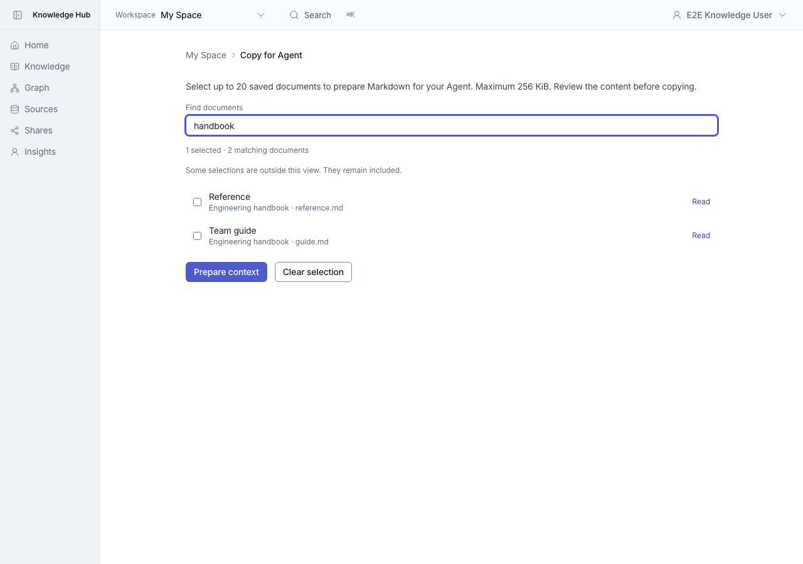
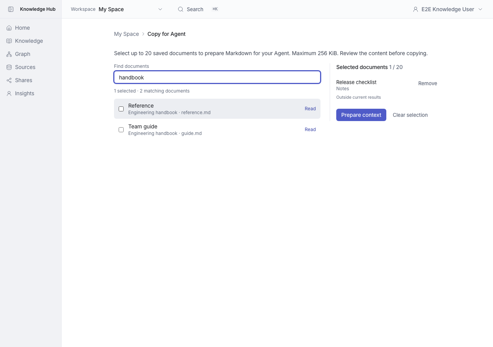
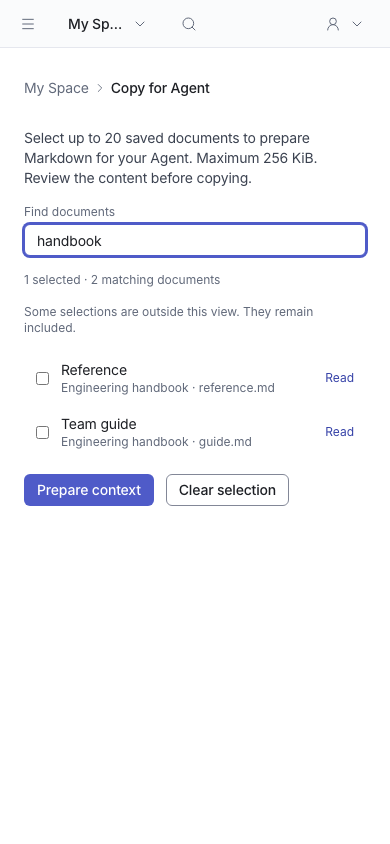
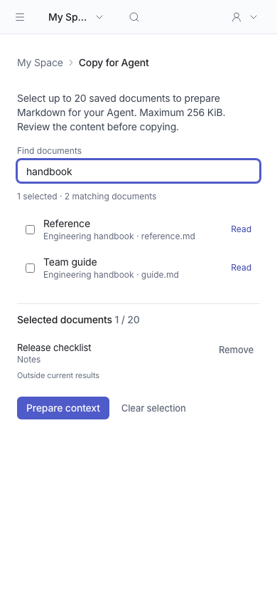

# Copy for Agent 選取流程

[English](README.md) | **繁體中文**

可用文件與已選文件分開呈現；已選文件顯示標題、來源、路徑與「Outside current results」，可逐一移除。候選列表限制高度，桌面右側操作區 sticky；手機版順序呈現。清除選取會取消尚未完成的請求，選取變更仍會使預覽失效。

## 驗證

- 每個 PR 均從 main `668aa03f` 分出，互不相依。
- 完整 unit suite：1,658 tests passed。
- lint、typecheck 及 Next production build 通過。
- 瀏覽器驗證：隱藏選取項目仍包含於 context、逐一移除、空選取停用、saved revision provenance、預覽失效與 clipboard fallback。

## 前後截圖

Before 為 main `668aa03f`；After 為本分支。使用相同隔離資料及狀態，桌面 1280×900、手機 390×844，light theme。時間戳記及 UUID 依各次測試產生。Settings 使用固定 Team owner persona；Audit 比較資料包含兩筆 workspace rename。

### agent-context

| 畫面 | 修正前 | 修正後 |
|---|---|---|
| desktop |  |  |
| mobile |  |  |
