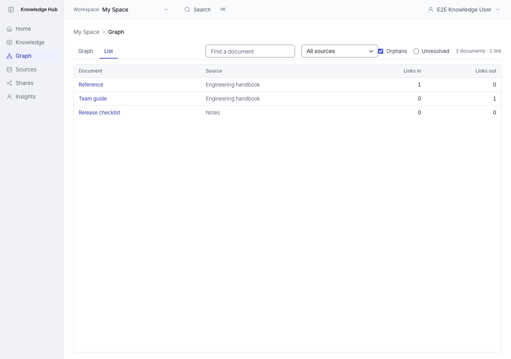
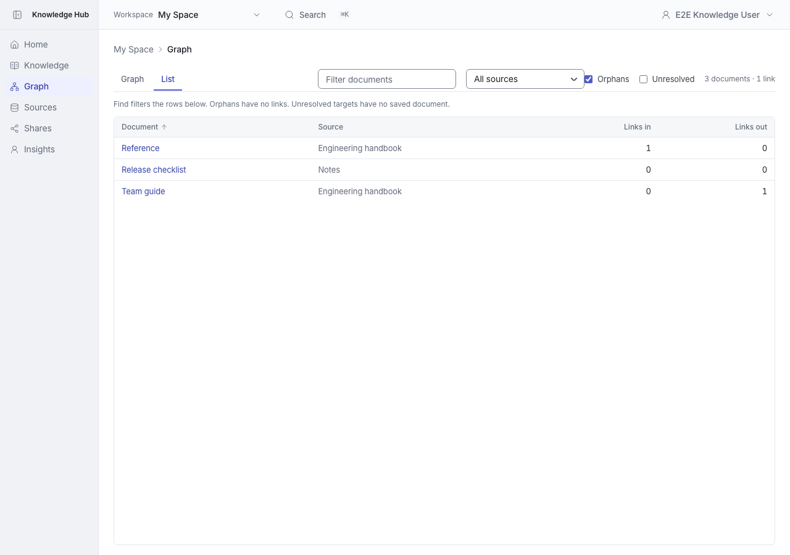
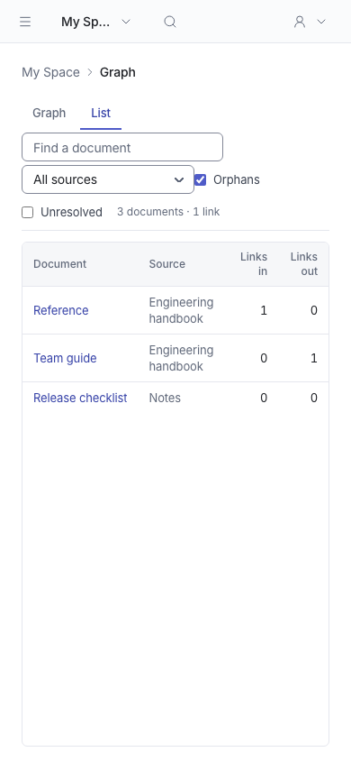
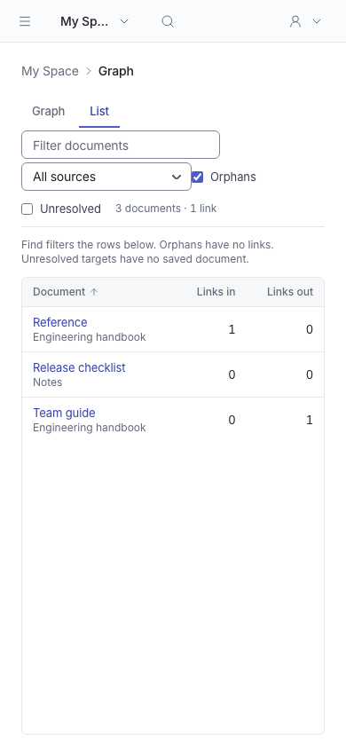
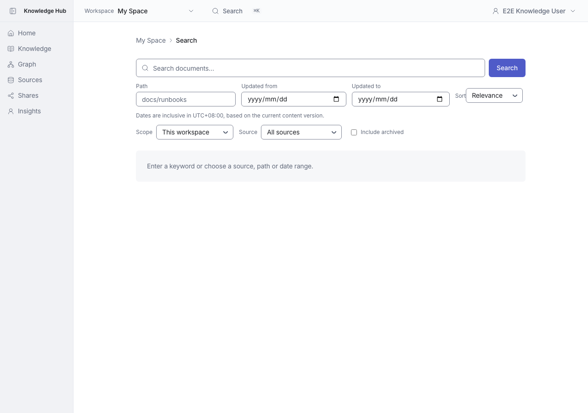
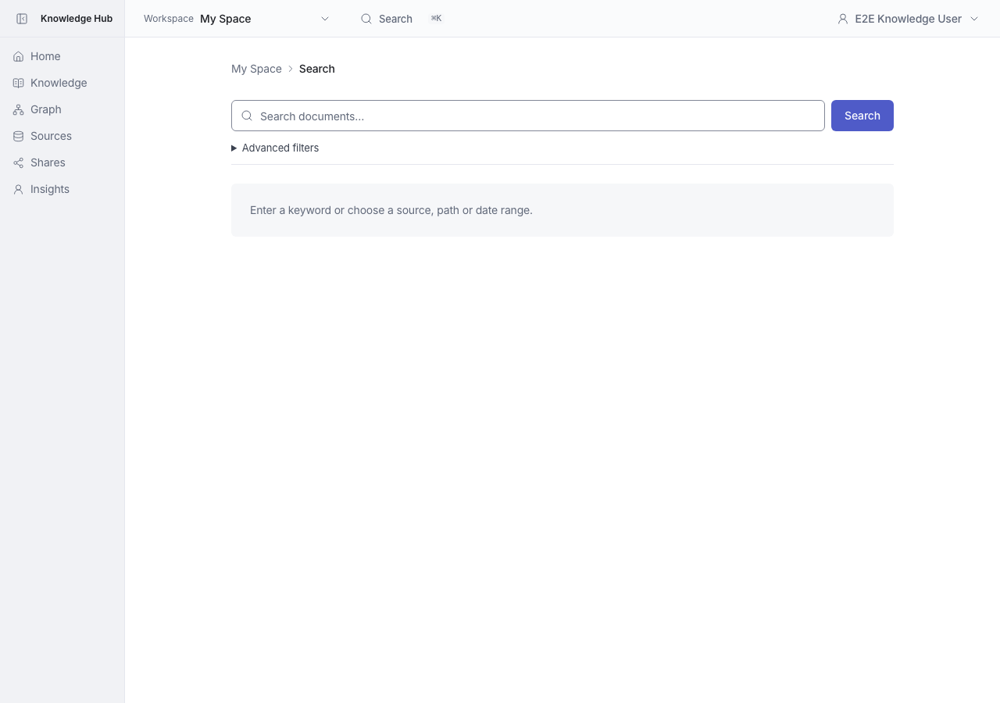
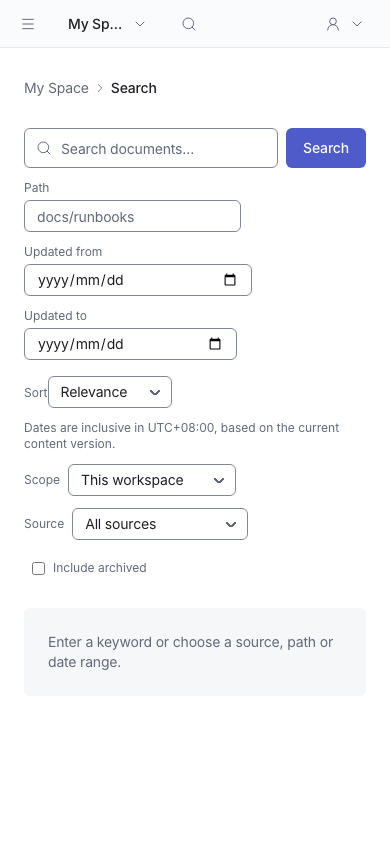
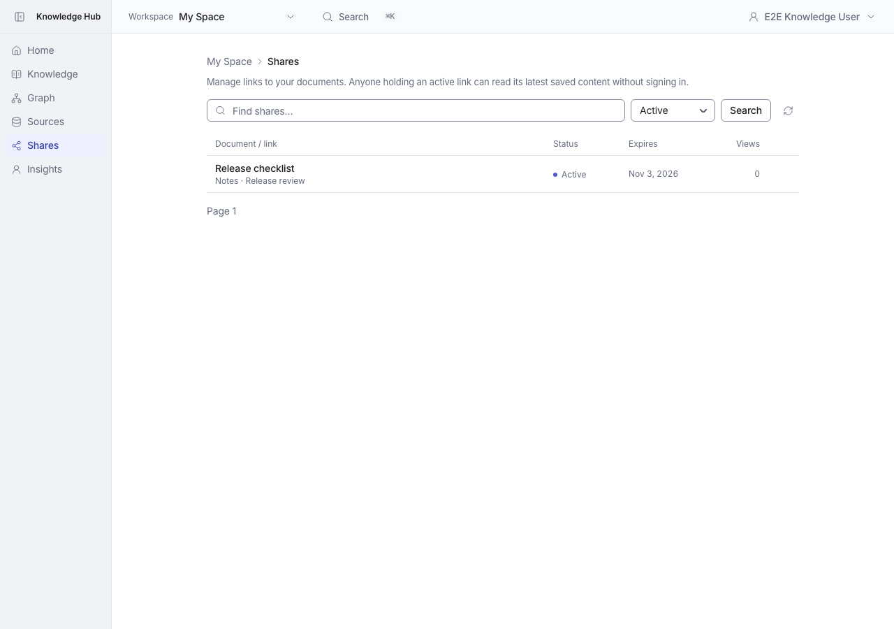

# Graph, Search and Shares interaction feedback

**English** | [繁體中文](README.zh-TW.md)

Graph explains how Find differs between modes, shows match counts and filter reset, supports title or incoming/outgoing-link sorting, and places the source beneath the title on mobile. Search collapses advanced filters, shows active conditions and clears filters while preserving the keyword. Shares adds direct copy, filter clearing and distinct empty states; permanent revocation uses the shared confirmation dialog with Keep focused by default.

## Verification

These are historical verification results from the original comparison PR:

- Each PR branched independently from main `668aa03f`.
- Full unit suite: 1,658 tests passed.
- Lint, typecheck and Next production build passed.
- Browser verification: Graph finding and sorting; search GET fallback, live search and access isolation; share-copy fallback, cancellation and permanent revocation.

## Before and after screenshots

Before uses main `668aa03f`; After uses the respective comparison branch. Captures use equivalent isolated data and state, desktop 1280×900 and mobile 390×844, in the light theme. Timestamps and UUIDs are generated per test run. Settings uses a fixed Team-owner persona; Audit comparison data includes two workspace-renaming events. These historical comparisons are separate from the freshly captured main README screenshots.

### graph

| View | Before | After |
|---|---|---|
| desktop |  |  |
| mobile |  |  |

### search

| View | Before | After |
|---|---|---|
| desktop |  |  |
| mobile |  |  |

### shares

| View | Before | After |
|---|---|---|
| desktop |  |  |
| mobile |  |  |
