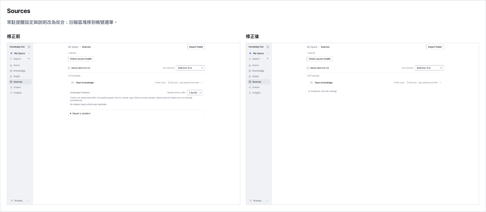
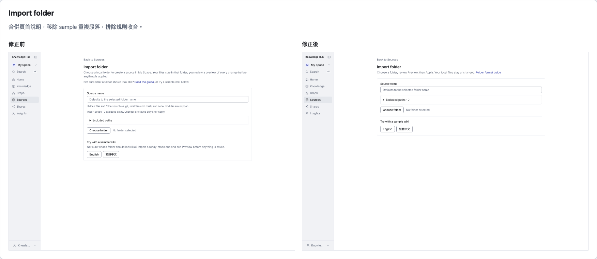
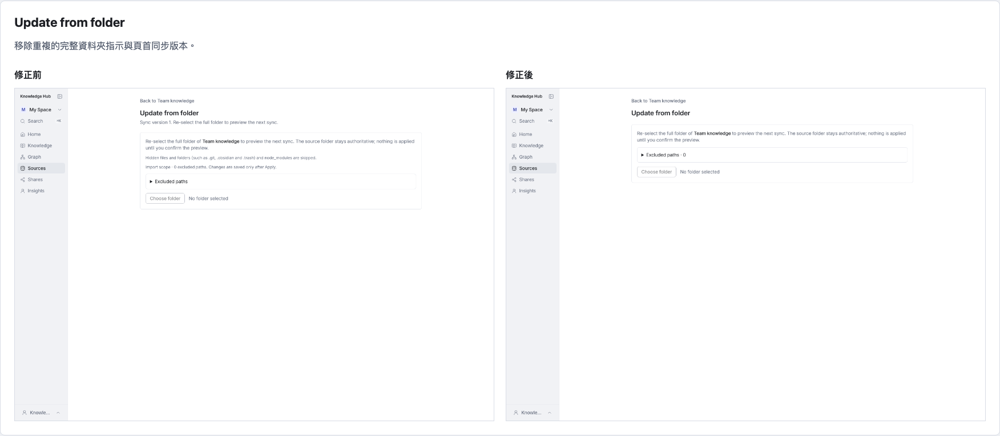
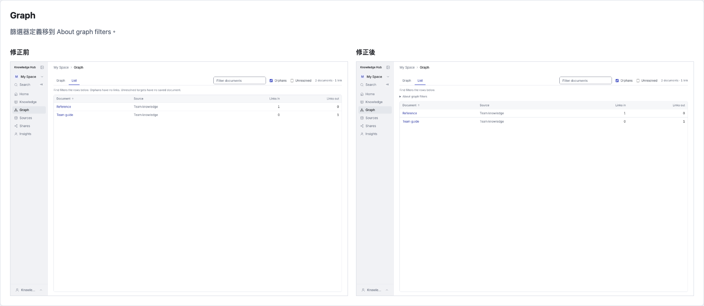
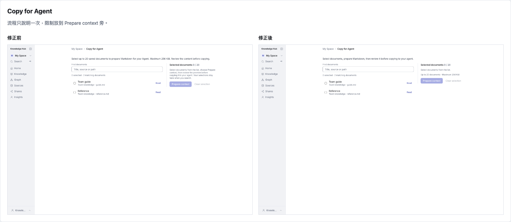
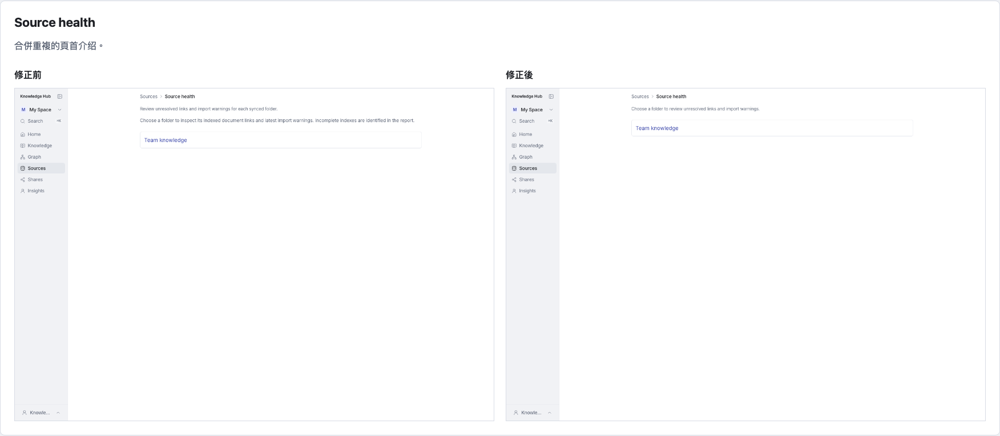
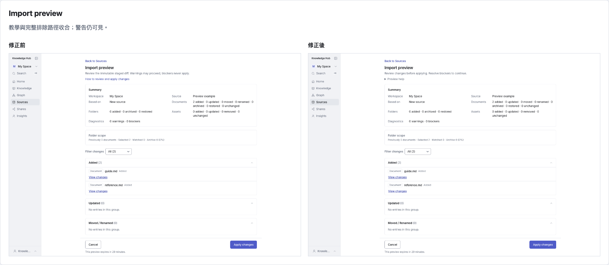
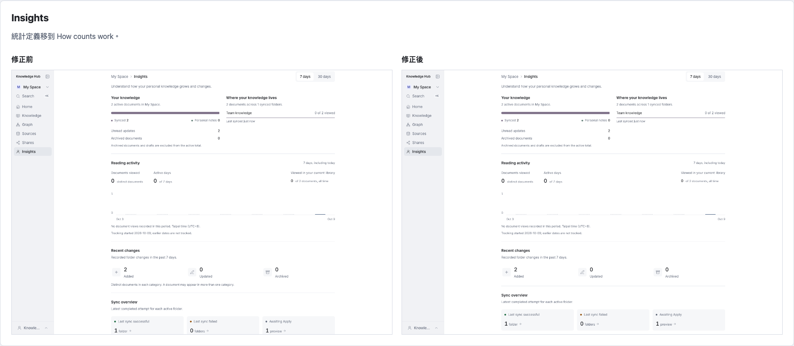

# 桌面版修正前後比較

基準：Git HEAD 743d7b3；修正後：目前未提交的工作區。相同 isolated synthetic database、local identity、淺色主題、1440 × 1000 視窗，實際 Next.js 開發頁面；full-page 截圖高度隨內容變動。包含本次精簡以及前面移動回報入口的修改。

[並排比較](index.html) · [擷取紀錄](evidence.json)

## Sources

常駐提醒設定與說明改為收合；回報區塊移到帳號選單。

## Import folder

合併頁首說明，移除 sample 重複段落，排除規則收合。

## Update from folder

移除重複的完整資料夾指示與頁首同步版本。

## Graph

篩選器定義移到 About graph filters。

## Copy for Agent

流程只說明一次，限制放到 Prepare context 旁。

## Source health

合併重複的頁首介绍。

## Import preview

教學與完整排除路徑收合；警告仍可見。

## Insights

統計定義移到 How counts work。

