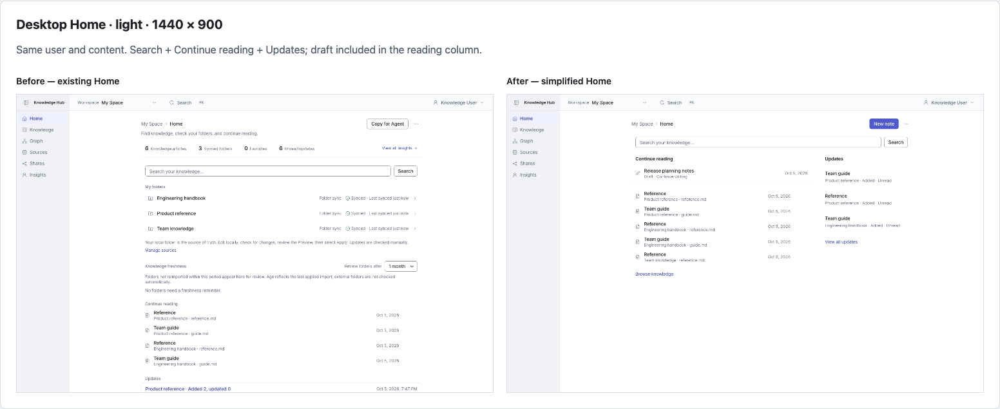
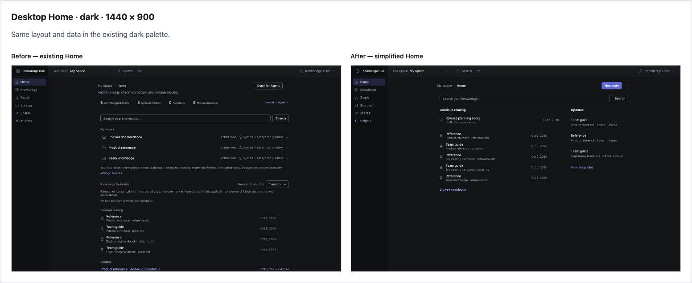
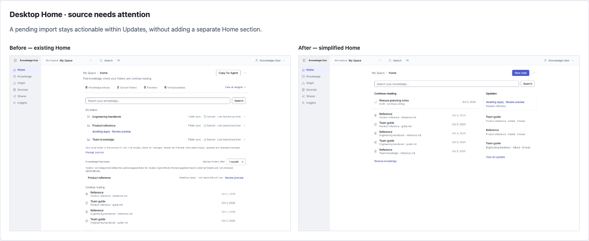
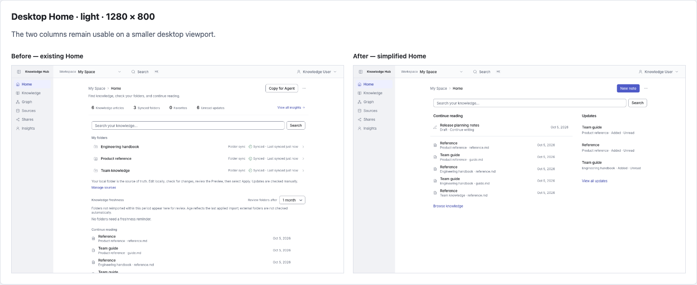

# Desktop Home comparison

Before: local Home immediately before this simplification, retaining earlier contrast/CSP/onboarding/error fixes. After: current desktop simplification. Both use the same isolated database, six imported documents and one draft, recent history, theme, viewport, application shell and fonts. Existing user's Getting started is dismissed in both. The attention pair stages a pending update to Product reference in the same database. No production data.

[Side-by-side gallery](index.html) · [Capture evidence](evidence.json)

To rerun: save a complete source snapshot before editing (src, public and root Next/Tailwind/TypeScript/package configs), then run `KM_HOME_BASELINE_ROOT=/path/to/snapshot npx tsx scripts/screenshots/home-desktop-simplification.ts`. Browser captures wait for recent history hydration before taking images.

## Desktop Home · light · 1440 × 900

Same user and content. Search + Continue reading + Updates; draft included in the reading column.

[Before](before-desktop-light.png) · [After](after-desktop-light.png) · [Before full page](before-desktop-light-full.png) · [After full page](after-desktop-light-full.png)

## Desktop Home · dark · 1440 × 900

Same layout and data in the existing dark palette.

[Before](before-desktop-dark.png) · [After](after-desktop-dark.png) · [Before full page](before-desktop-dark-full.png) · [After full page](after-desktop-dark-full.png)

## Desktop Home · source needs attention

A pending import stays actionable within Updates, without adding a separate Home section.

[Before](before-desktop-attention.png) · [After](after-desktop-attention.png) · [Before full page](before-desktop-attention-full.png) · [After full page](after-desktop-attention-full.png)

## Desktop Home · light · 1280 × 800

The two columns remain usable on a smaller desktop viewport.

[Before](before-desktop-1280.png) · [After](after-desktop-1280.png) · [Before full page](before-desktop-1280-full.png) · [After full page](after-desktop-1280-full.png)
