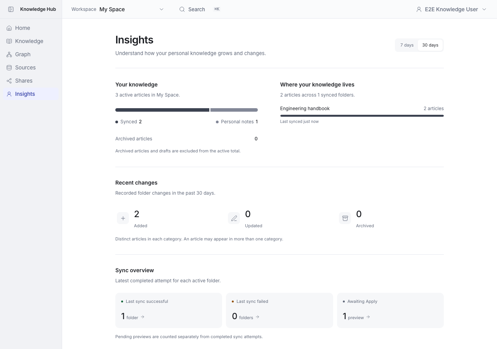
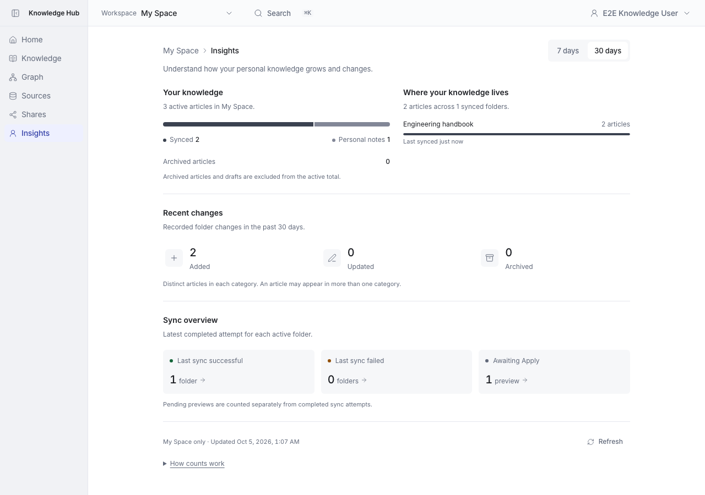
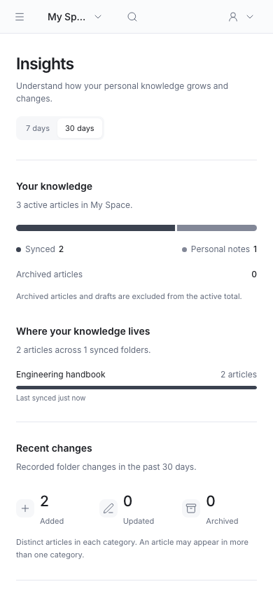
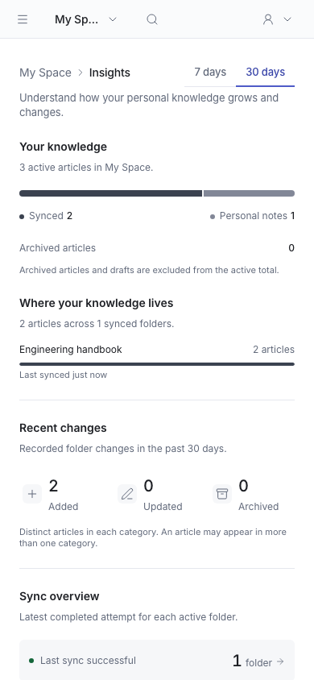
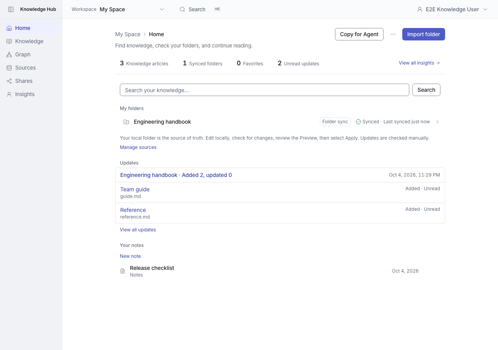
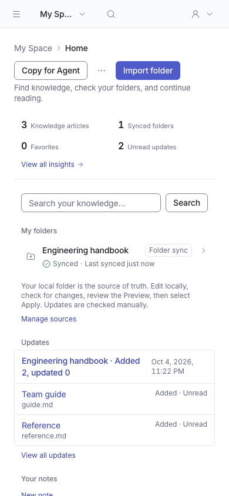

# Insights／Home 設計一致性

[English](README.md) | **繁體中文**

Insights 使用共用 PageHeader 與 kh-page，期間使用無陰影的分段切換；字級、間距和圓角回到既有設計尺度，移除普通控制項陰影及未使用樣式。Home 搜尋框改由 Input primitive 提供邊框、尺寸與 focus 樣式。

## 驗證

- 每個 PR 均從 main `668aa03f` 分出，互不相依。
- 完整 unit suite：1,658 tests passed。
- lint、typecheck 及 Next production build 通過。
- 瀏覽器驗證：個人統計、明細連結、7/30 天切換、刷新、明暗主題與手機版；Home 搜尋與既有 overview。

## 前後截圖

Before 為 main `668aa03f`；After 為本分支。使用相同隔離資料及狀態，桌面 1280×900、手機 390×844，light theme。時間戳記及 UUID 依各次測試產生。Settings 使用固定 Team owner persona；Audit 比較資料包含兩筆 workspace rename。

### profile

| 畫面 | 修正前 | 修正後 |
|---|---|---|
| desktop |  |  |
| mobile |  |  |

### home

| 畫面 | 修正前 | 修正後 |
|---|---|---|
| desktop |  |  |
| mobile |  |  |
