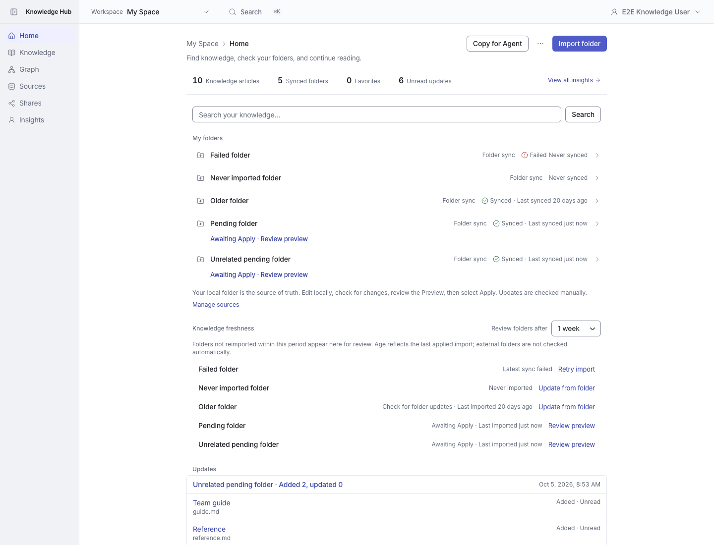
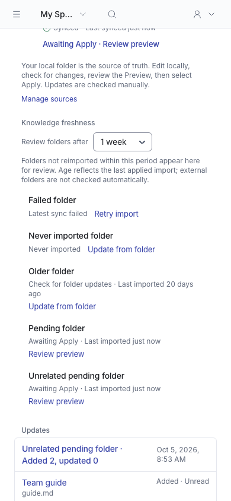

# Knowledge freshness reminders

Home lists folders awaiting Apply, with a failed latest sync, never imported, or older than the selected threshold. Each row links to the preview or the folder update flow.

Personal workspace only. Default 1 month (30 days), with 1 week / 2 weeks / 1 month choices saved across sessions. Existing saved preferences are preserved. The control is labeled “Review folders after”; old imports show “Check for folder updates” rather than asserting that content is outdated. Age is measured from the last successfully applied import; external folders are not checked automatically. Pending preview takes priority, then failure, then never imported, then age. Archived folders, uploads and Hub-managed sources are excluded.

## Desktop

## Mobile

## Verification

Production build and isolated MariaDB browser test: `tests/e2e/mvp-freshness.spec.ts`. Domain and API tests cover validation, fixed preference keys and version conflicts. Shared preference integration tests cover persistence, concurrent writes and owner/workspace isolation. Screenshots use synthetic test data.

The isolated fixture shows all four states and verifies the pending preview link. Mobile rows keep the full folder name on its own line.
