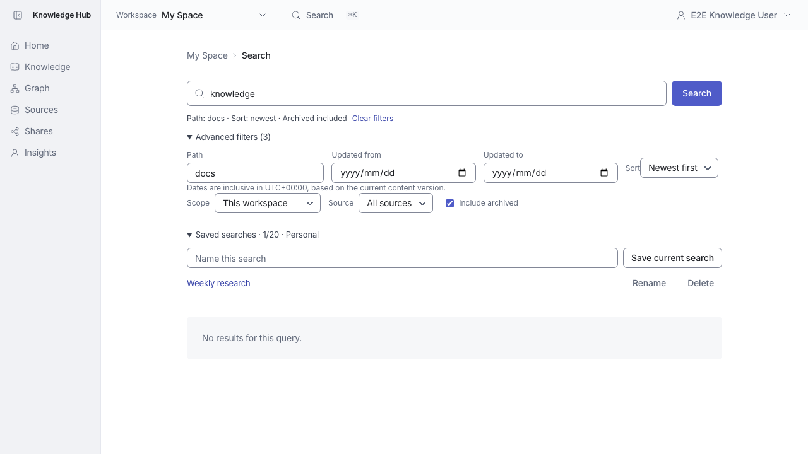
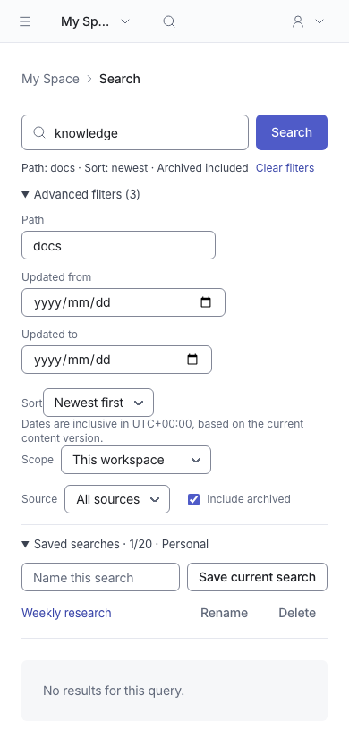

# Saved searches

Search now offers personal named views with save, reopen, rename and delete. Reopening restores query, scope, source, path, date range, UTC offset, sort and archive inclusion, and starts at the first page.

Maximum 20 views, names up to 80 characters. Names may repeat; stable IDs identify each view. Personal workspace owner only. Preferences persist in the existing personal_items table and use version-based compare-and-swap. Foreign source IDs and unknown filter keys are rejected.

## Desktop

## Mobile

## Verification

Production build and isolated MariaDB browser test: `tests/e2e/mvp-saved-searches.spec.ts`. Domain and API tests cover validation, fixed preference keys and version conflicts. Shared preference integration tests cover persistence, concurrent writes and owner/workspace isolation. Screenshots use synthetic test data.

Includes a separate conflict.png showing a stale write and the latest views loaded for review.
