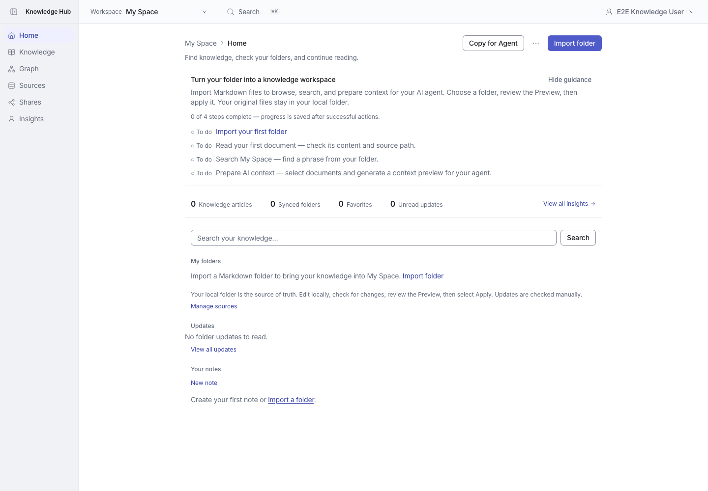
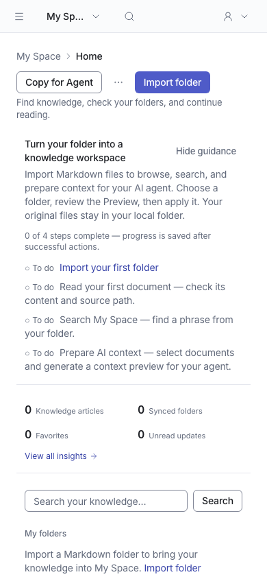
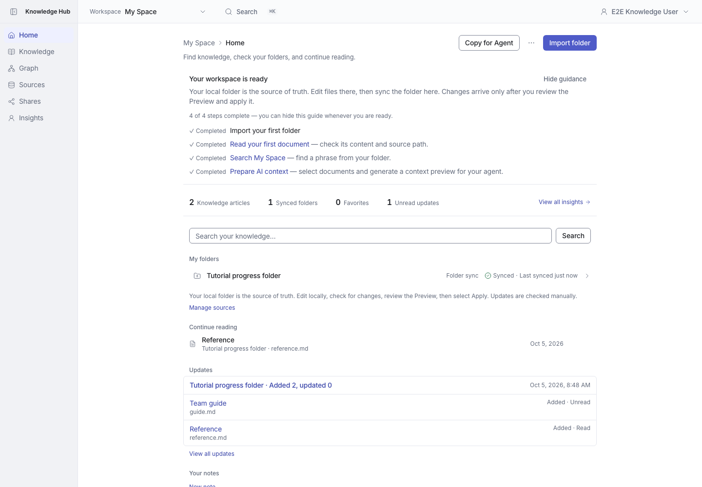
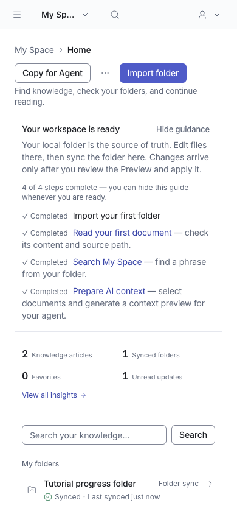

# First-use introduction and completion progress

Home now introduces folder import before the first folder exists. It explains what importing enables and the choose → Preview → apply sequence. Later actions become links after a folder is available.

The guide shows four explicit statuses. Import is complete when an active imported folder exists; a Preview alone does not count. Reading is recorded after the authorized revision-read operation succeeds. Searching is recorded after a nonempty My Space query succeeds, including zero results. Preparing context is recorded after a valid selection produces a preview. Opening links, empty searches, invalid selections, and failed operations do not complete these steps.

Read, search, and context completion persist in owner-only workspace preferences across browser sessions. They use independent compare-and-swap keys, leaving the existing Hide guidance preference compatible. Progress writes are auxiliary: a storage failure does not fail the underlying action.

Screenshots were captured by `tests/e2e/00-onboarding-progress.spec.ts` using the production build and an isolated database. The test exercises the full flow and checks mobile overflow.

| State | Desktop (1440 × 1000) | Mobile (390 × 844) |
| --- | --- | --- |
| Before first import |  |  |
| Four steps completed |  |  |

Previous merged design: [PR #117 screenshots](../mvp-onboarding/README.md).

Validation: 1683 unit tests passed; 3 owner preference integration tests passed, including concurrent completion and service restart; 3 browser tests passed; typecheck, lint, and production build passed.
