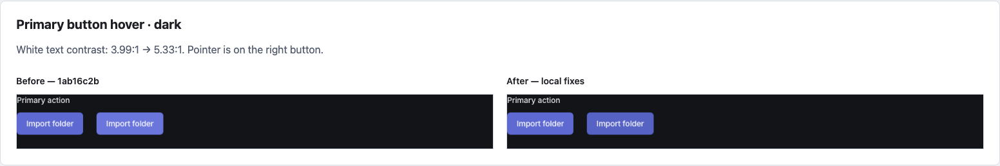
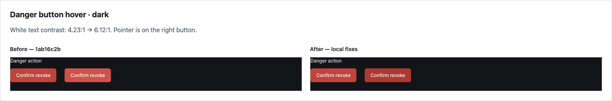
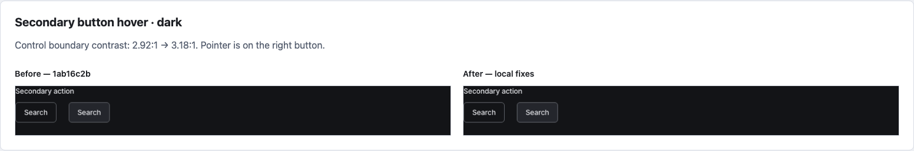
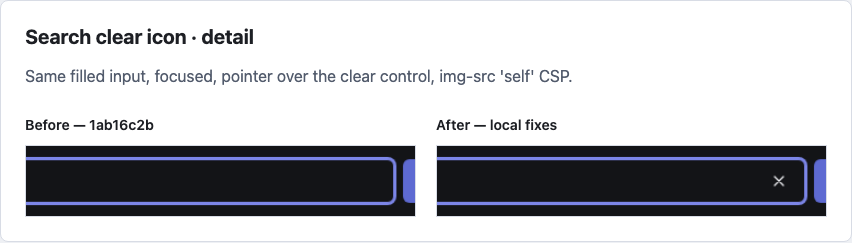
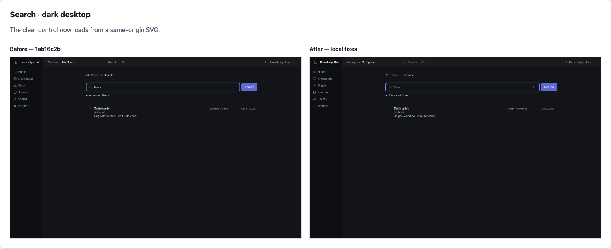
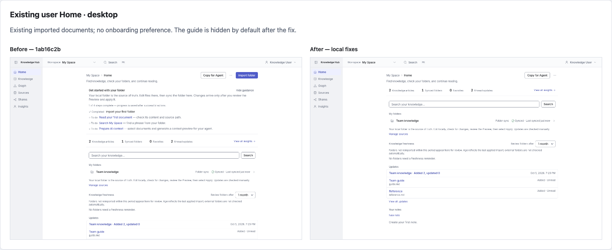
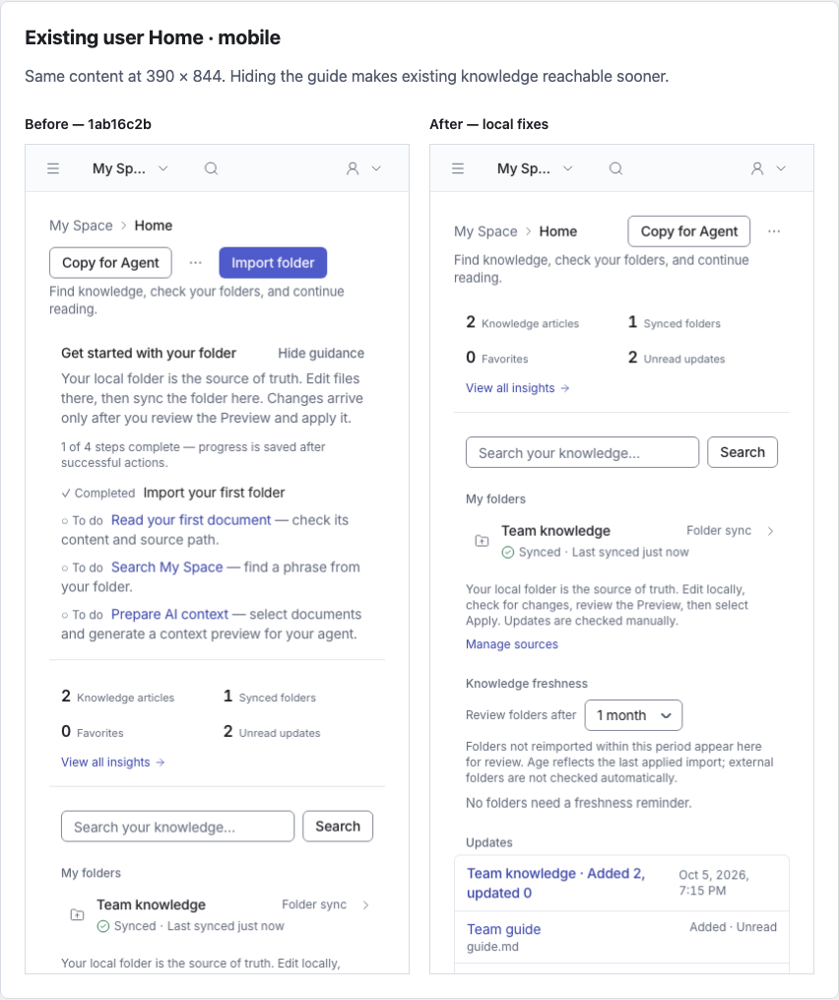
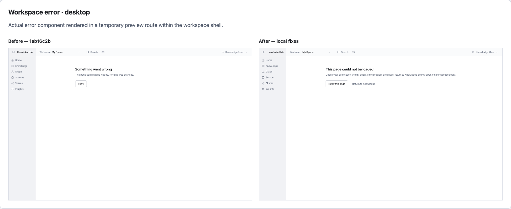
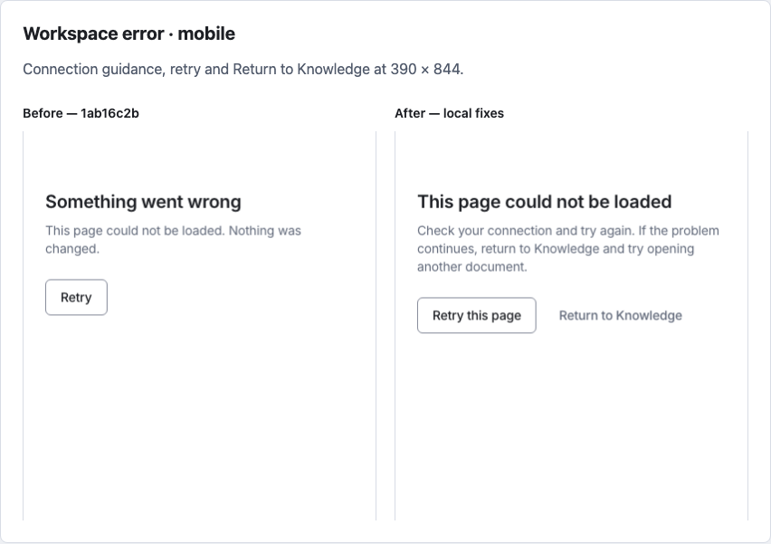

# UI recovery fixes comparison

Baseline: main `1ab16c2b`. After: current local fixes. Captures use actual Next.js application pages and components, an isolated synthetic database, identical viewports, and the same CSP. Button and error states are presented by a temporary preview route, removed during cleanup. Desktop: 1440 × 900; mobile: 390 × 844.

[Open the side-by-side gallery](index.html). [Capture evidence](evidence.json).

## Primary button hover · dark

White text contrast: 3.99:1 → 5.33:1. Pointer is on the right button.

[Original before](before-button-primary-dark.png) · [Original after](after-button-primary-dark.png)

## Danger button hover · dark

White text contrast: 4.23:1 → 6.12:1. Pointer is on the right button.

[Original before](before-button-danger-dark.png) · [Original after](after-button-danger-dark.png)

## Secondary button hover · dark

Control boundary contrast: 2.92:1 → 3.18:1. Pointer is on the right button.

[Original before](before-button-secondary-dark.png) · [Original after](after-button-secondary-dark.png)

## Search clear icon · detail

Same filled input, focused, pointer over the clear control, img-src 'self' CSP.

[Original before](before-search-clear-detail.png) · [Original after](after-search-clear-detail.png)

## Search · dark desktop

The clear control now loads from a same-origin SVG.

[Original before](before-search-dark.png) · [Original after](after-search-dark.png)

## Existing user Home · desktop

Existing imported documents; no onboarding preference. The guide is hidden by default after the fix.

[Original before](before-home-desktop.png) · [Original after](after-home-desktop.png)

## Existing user Home · mobile

Same content at 390 × 844. Hiding the guide makes existing knowledge reachable sooner.

[Original before](before-home-mobile.png) · [Original after](after-home-mobile.png)

## Workspace error · desktop

Actual error component rendered in a temporary preview route within the workspace shell.

[Original before](before-error-desktop.png) · [Original after](after-error-desktop.png)

## Workspace error · mobile

Connection guidance, retry and Return to Knowledge at 390 × 844.

[Original before](before-error-mobile.png) · [Original after](after-error-mobile.png)
